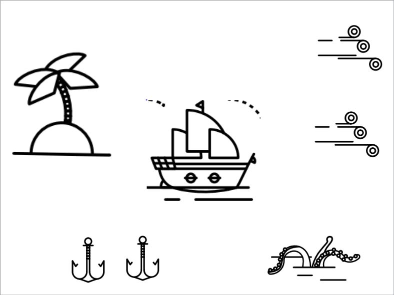
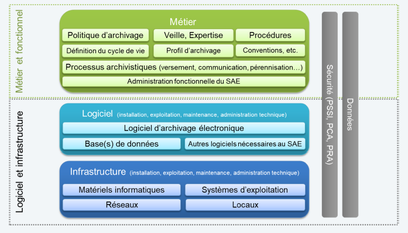

class: inverse, center, middle
background-image: url(./media/continuum.jpg)
background-position: top;
background-repeat: no-repeat;
background-size: contain;
.footnote[Ceci est fait en texte avec du logiciel libre]

# formation CD77
## Mai 2018

### Au programme

1. choisir une quête
2. identifier les scenarii possible
3. jouer
4. évaluation
---
## Agenda
* Matin premier jour : rappel des épisodes précédents
* Après-midi premier jour : choisir une quête et un scenario
* Matin deuxième jour : réaliser la quête
* Après-midi deuxième jour : partage de quête et évaluation

.reduite2[]
---
## Retrospective
.reduite[]
---
class: center, middle

## Jeu dont vous êtes le héros (ou l'héroïne)
Mettre en production un SAE
---
class: center, middle

## Règles du jeu
Par équipes de 3 vous devrez mener à bien votre quête en parcourant les forêts mystérieuses de la dématérialisation administrative.
---
class: center, middle

## Carte au trésor du pays de la théorie

---
name: mvp-question
class: center, middle

## Les bonnes questions pour démarrer
1. Identifier les parties prenantes (éventuellement les premiers utilisateurs de la solution mise en place)
2. Identifier leurs problèmes (et les solutions (de contournement) qu’ils utilisent)
3. Identifier les solutions disponibles
4. Identifier les critères d’évaluation de la valeur apportée par la solution envisagée
5. Identifier les critères de légitimité du(des) porteur de projets
6. Identifier les canaux de communication mobilisables pour faire parler de son projet
7. Identifier le concept à haute valeur ajoutée et la proposition de valeur associée au projet
8. Identifier les coûts
9. Identifier les revenus ou les gains
---
class: center, middle

## Choix de la quête
1. Je suis une municipalité de Seine-et-Marne et je veux archiver électroniquement mes marchés publics

* [ressource pédagogique](https://www.economie.gouv.fr/daj/ouverture-des-donnees-commande-publique)
* [bibliothèque de référence pour l'archivage numérique](https://francearchives.fr/fr/article/26287443)
---
name: 1.1
class: center, middle

# internalisation :

* aller à la page [sc-interne](#sc-interne)
---
name: 1.1.1
class: center, middle

# j'ai déjà un SAE :

[se poser les 9 question](#mvp-question)
---
name: 1.1.1.1
class: center, middle

# écrire le profil

conformément à l'arrêté du 14 avril 2017 relatif aux données essentielles dans la commande publique (https://www.economie.gouv.fr/files/files/directions_services/daj/marches_publics/ouverture-donnees/referentiel_marches_publics.pdf)
---
name: 1.1.1.2
class: center, middle

# écrire le contrat de versement avec la direction des marchés

en vous inspirant du modèle du SIAF (https://francearchives.fr/file/08d5cc7f7b6229a5845e9b6a5e7efbc214d8b2ce/BDR_04_Contrat_de_versement_sans_notice.odt)
---
name: 1.1.1.3
class: center, middle

# mettre à jour le référentiel de la politique d'archivage
---
name: 1.1.1.4
class: center, middle

# procéder à l'association du profil avec la direction des marchés de votre autorité d'archivage
---
name: 1.1.1.5
class: center, middle

# procéder au versement d'un marché :

(https://github.com/akakeronos/formations/raw/master/ad77/exemples/exempleMarche.zip.zip)
---
name: 1.1.1.5.1
class: center, middle

## en remplissant le formulaire associé au profil dans le site versant de la direction des marchés
---
name: 1.1.1.5.2
class: center, middle

## en créant une arborescence de fichiers et de dossiers dans le dossier profilable de l'espace documenaire du site versant de la direction des marchés
---
name: 1.1.1.5.3
class: center, middle

## en important le dossier zippé dans l'espace documentaire du site versant de la direction des marchés
---
name: 1.1.1.6
class: center, middle

# accepter ce versement dans le SAE
---
name: 1.1.1.7
class: center, middle

# éliminer les pièces et dossiers éliminables
---
name: 1.1.1.8
class: center, middle

# communiquer les dossiers communicables
---
name: 1.1.1.9
class: center, middle

# restituer le marché dans le site de la direction des marchés
---
name: 1.1.2
class: center, middle

# je dois mettre en place un SAE
---
name: 1.1.2.1
class: center, middle

# je loue un SAE existant
---
name: 1.1.2.1.1
class: center, middle

## je définis l'espace de conservation numérique
---
name: 1.1.2.1.2
class: center, middle

## je met à jour la PSSI
---
name: 1.1.2.1.3
class: center, middle

## je procède à un test de réversibilité
---
name: 1.1.2.1.4
class: center, middle

## je rédige un support pédagogique pour les collègues de la direction des marchés
---
name: 1.1.2.2
class: center, middle

# je développe mon propre SAE
[se poser les 9 question](#mvp-question)
---
name: 1.1.2.3
class: center, middle

## je liste mes exigences fonctionnelles
écrire mes 10 histoires utilisateurs prioritaires
---
name: 1.1.2.4
class: center, middle

# je valide mes exigences fonctionnelles
écrire mes 10 tests de validation
---
name: 1.1.2.5
class: center, middle

# se rendre au [1.1.2.1.1](#1.1.2.1.1)
---
name: 1.1.2.6
class: center, middle

# se rendre au [1.1.1.1](#1.1.1.1)
---
name 1.1.2
class: center, middle

# externalisation AI : aller à la page 30
---
name 1.3
class: center, middle

# externalisation AI et AD :
aller à la page [sc-depot-EPCI](#sc-depot-EPCI)
---
name: sc-interne
class: center, middle

## **Scénario internalisation**
La collectivité gère en son sein ses propres archives

* Prérequis : disposer au moins d’1 archiviste présent dans la collectivité prenant en charge les dépôts d’archives, leur gestion et leur valorisation, et accompagnant les services de la collectivité dans la mise en oeuvre des versements et l'utilisation du SAE
---
class: center, middle

## **Scénario internalisation**

* Conditions de réussite / collectivité demandeuse :
  * RH AE : quelles sont les ressources mobilisables côté archives ?
    * 0,5 à 1 ETP minimum dédié à la gestion des archives électroniques durant la phase de mise en œuvre
    * Puis 0,25 à 0,5 ETP minimum par la suite pour gérer le dispositif
    (fonction de la taille et des besoins de la collectivité)
  * RH SI : quelles sont les ressources mobilisables côté numérique ?
    * Des ressources SI internes suffisantes pour mettre en œuvre la solution, puis la maintenir et l'exploiter et mettre en œuvre puis maintenir les connecteurs
  * Compétences SI particulières : expérience dans les traitements de données, métadonnées, protocoles de communication, format de fichiers, structuration de l’information. Plutôt formation infoDoc que génie logiciel
* RH métiers : quelles sont les ressources mobilisables dans les directions métiers ?
  * Des référents métiers identifiés dans les directions pour contribuer ponctuellement à la définition et la mise en œuvre de règles d'archivage
  * Mise en œuvre d’un réseau de référent en archivage qui sont formés et accompagnés à l’exercice régulier des processus d’archivage. Réseau extensible à la gestion du cycle de vie courant(RM) et à l’accès aux données administratives (Open Data)
---
class: center, middle

## **Scénario internalisation**

* Moyens techniques : quelles sont les infrastructures disponibles ?
    * Des infrastructures techniques sécurisées, conformes à l'état de l'art en matière d'archivage électronique
    * Un environnement de virtualisation, un expert système et réseau pour une architecture forcément redondée et sécurisée
  * Moyens financiers : quels sont les budgets disponibles ?
    * Entre 50 et 250 K€ sur 5 ans pour acquérir, mettre en œuvre et maintenir la solution
    * Puis des coûts de maintenance et de reversibilité
    (fonction de la taille et des besoins de la collectivité)
---
class: center, middle

## **Scénario internalisation**

  * volonté stratégique : Y-a-t-il une stratégie définie ? Un sponsor ?
    * Volonté affirmée et pérenne dans le temps vis-à-vis des enjeux et de la démarche de la part de la Direction Générale, de la Direction des Archives, de la Direction des systèmes d'information, voire des élus
    * Doit s’intégrer à une stratégie plus globale de dématérialisation productive et de qualité de service

  * maturité : quelle est la maturité de l'organisation par rapport au numérique ?
    * Expérience affirmée des projets de dématérialisation
    * Vision urbanisée du système d'information
    * Gouvernance des projets systèmes d'information opérationnelle
    * Veille et retours d'expérience associés à la mise en œuvre de l'archivage électronique
---
class: center, middle

## Identifier les forces et faiblesses de votre scenario

---
class: center, middle

### Forces
1. Indépendance dans les choix liés au SAE
2. relation directe avec les éditeurs de solutions à archiver
3. qualité de service pour les services producteurs
4. développement d’une culture métier de la conservation et du traitement des données côté SI et d’une culture du numérique dans le service archives. Compétences utiles pour le reste des projets numériques
---
class: center, middle

### Forces

#### Option SAE-M : Mutualisation de logiciels et / ou infrastructure
  (Code général des collectivités territoriales)
  1. Optimisation des moyens techniques, financiers et RH SI
  2. Mise en conformité du dispositif
#### Option SAE-E : Externalisation de logiciels et / ou infra. chez un tiers
  (Droit des marchés publics)
    1. Optimisation des moyens techniques, financiers et RH SI
    2. Mise en conformité du dispositif
---
class: center, middle

### Faiblesses
1. Coûts et charges de mise en œuvre et de maintenance du SAE et des connecteurs
2. Niveau de compétences et pérennité des ressources
3. Capacité à influer sur les feuilles de route des éditeurs de solutions à archiver
4. Niveau de conformité, pérennité et évolutivité du SAE
---
class: center, middle

### Faiblesses

#### Option SAE-E : Externalisation de logiciels et / ou infra. chez un tiers
  (Droit des marchés publics)
  1. Risque de défaillance du fournisseur
  2. Réversibilité en fin de marché
  3. qualité de service
  4. coût du service
#### Option SAE-M : Mutualisation de logiciels et / ou infrastructure
  1. Risque de changement de stratégie des partenaires
  2. Risque de disparition / évolution des compétences des partenaires

---
class: center, middle
name: sc-depot-EPCI

## **Scénario 2 : dépôt au sein d'un EPCI**
La collectivité externalise son archivage

* Prérequis : L'EPCI ou une de ses communes membres
  - s'engagent vis-à-vis des autres communes de l'EPCI à mettre à disposition un service d'archivage électronique
  - disposent des moyens et compétences suffisantes pour prendre en charge les dépôts et accompagner les collectivités dans la mise en œuvre des versements et l'utilisation du SAE
---
class: center, middle
name: sc-depot-EPCI

## **Scénario 2 : dépôt au sein d'un EPCI**

* Conditions de réussite / collectivité demandeuse :
  * RH AE : quelles sont les ressources mobilisables côté archives ?
    * 1 référent identifié pour traiter les questions d'archivage électronique
  * RH SI : quelles sont les ressources mobilisables côté numérique ?
    * Des ressources SI suffisantes pour mettre en œuvre puis maintenir les connecteurs
---
class: center, middle
name: sc-depot-EPCI

## **Scénario 2 : dépôt au sein d'un EPCI**

  * RH métiers : quelles sont les ressources mobilisables dans les directions métiers ?
    * Des référents métiers identifiés dans les directions pour contribuer ponctuellement à la définition et la mise en œuvre de règles d'archivage

  * Moyens techniques : quelles sont les infrastructures disponibles ?
    * Un dispositif d'échanges de données sécurisé entre le SI de la collectivité et l'EPCI ou la commune membre
    * Des solutions métiers à archiver homogènes entre les différentes communes membres de l'EPCI
---
class: center, middle
name: sc-depot-EPCI

## **Scénario 2 : dépôt au sein d'un EPCI**

  * Moyens financiers : quels sont les budgets disponibles ?
    * Entre 0 et 50 K€ sur 5 ans pour contribuer aux moyens mis en œuvre par l'EPCI ou la commune membre (suivant le modèle économique défini par l'EPCI)
---
class: center, middle
name: sc-depot-EPCI

## **Scénario 2 : dépôt au sein d'un EPCI**

  * volonté stratégique : Y-a-t-il une stratégie définie ? Un sponsor ?
    * Validation générale des enjeux et de la démarche par la direction générale.
    * Intérêt pour la mutualisation
    * Confiance vis-à-vis de la pérennité, des compétences archivistiques et des moyens informatiques mis à disposition par l'EPCI ou la commune membre
---
class: center, middle
name: sc-depot-EPCI

## **Scénario 2 : dépôt au sein d'un EPCI**

  * maturité : quelle est la maturité de l'organisation par rapport au numérique ?
    * Système d'information maîtrisé
    * Projets de dématérialisation engagés
    * Sensibilité vis-à-vis des enjeux et contraintes associées aux projets mutualisés dans le domaine du numérique

---
class: center, middle
## Identifier les forces et faiblesses de votre scenario

---
class: center, middle

### Forces
1. Mutualisation des coûts et charges à l'échelle de l'EPCI
2. Compétences et moyens techniques mobilisables potentiellement  plus importants que pour le scénario 1
---
class: center, middle

### Forces

#### Option SAE-M : Mutualisation de logiciels et / ou infrastructure
  (Code général des collectivités territoriales)
  1. Optimisation des moyens techniques, financiers et RH SI
  2. Mise en conformité du dispositif
#### Option SAE-E : Externalisation de logiciels et / ou infra. chez un tiers
  (Droit des marchés publics)
    1. Optimisation des moyens techniques, financiers et RH SI
    2. Mise en conformité du dispositif
---
class: center, middle

### Faiblesses
1. Gouvernance du dispositif plus complexe que pour le scénario 1
2. Adéquation avec les spécificités des différentes collectivités (notamment connecteurs)
3. Capacité d'accompagnement des communes
---
class: center, middle

### Faiblesses

#### Option SAE-E : Externalisation de logiciels et / ou infra. chez un tiers
  (Droit des marchés publics)
  1. Risque de défaillance du fournisseur
  2. Réversibilité en fin de marché
  3. qualité de service
  4. coût du service
---
class: center, middle

### Faiblesses

#### Option SAE-M : Mutualisation de logiciels et / ou infrastructure
  1. Risque de changement de stratégie des partenaires
  2. Risque de disparition / évolution des compétences des partenaires

---
