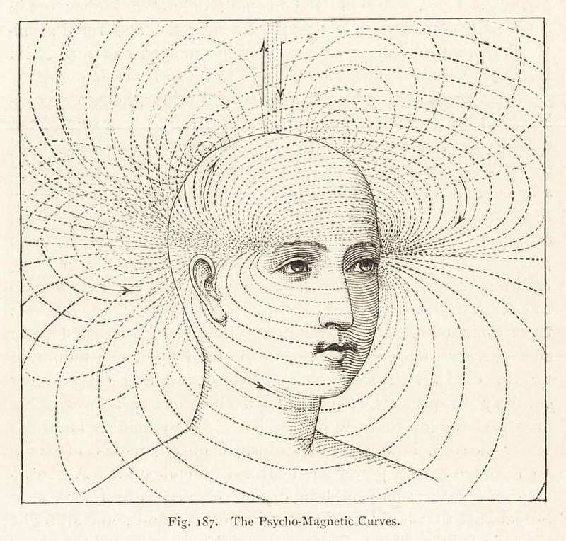
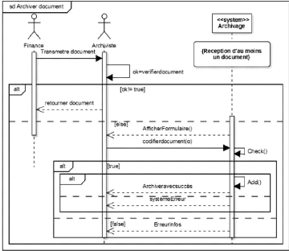
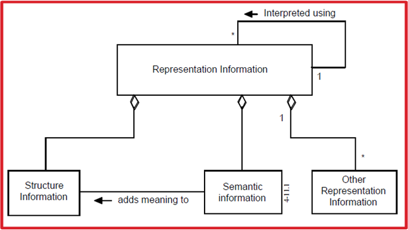

class: inverse, center, middle
background-image: url(./media/continuum.jpg)
background-position: top;
background-repeat: no-repeat;
background-size: contain;
.footnote[Ceci est fait en texte avec du logiciel libre]

# formation CD77
## avril-Mai 2018

### Au programme

1. Qu'est ce que l'archivage électronique
2. Démonstration et retours d'expérience
3. Mise en pratique
---
# Qui suis-je ?
.pull-left[
Agent public au département de la Gironde : j’ai coordonné plusieurs projets dans le domaine de l'ingénierie documentaire
(SAE, GED, Open data)

Facilitateur numérique : je contribue à renforcer le pouvoir d'agir des utilisateurs au travers d'un accompagnement aux usages (conscients) du numérique.

@keronos
]
.pull-right[

]
.footnote[(illustration : Moebius)]
---
## Agenda
* Matin premier jour : qu’est-ce qu’un SAE ?
* Après-midi premier jour : L’environnement réglementaire et normatif de l’archivage électronique
* Matin deuxième jour : démonstration du SAE Girondin et retours d'expériences
* Après-midi deuxième jour : Atelier pratique mon premier versement

.reduite2[]
---
## Tous dans le même bateau
.reduite[]
---
## Tout ce que vous avez toujours voulu savoir sur l'archivage électronique

---
## Les bases

**Définitions**

> **Record management** : organisation en charge d'un contrôle efficace et systématique de la création, de la réception, de la conservation, de l'utilisation et du sort final des documents. norme ISO 15489-1

> L’**archivage pérenne** des documents électroniques : **conservation** des documents et données et **des informations** qu’ils contiennent :
* Dans leur aspect physique comme dans leur aspect intellectuel
* Sur le très long terme
* De manière à ce qu’ils soient en permanence accessibles et compréhensibles

> **Système d’archivage électronique (SAE)** : système consistant à recevoir, conserver, communiquer et restituer des archives et qui s’appuie sur une plate-forme informatique. norme NF Z42-013

> **Gestion électronique des documents (GED, GEIDE, ECM)** : outil informatique permettant d'organiser et de gérer des documents ou données électroniques au sein d'un organisme.

---
## Les 3 âges électroniques
<!--L'archivage numérique est donc un processus dynamique qui commence dès la création des documents.-->

---
## Vous êtes déjà des archivistes

|Critères|Archivage traditionnel|
|:----------------:|:-------------:|
|Pérennité|Qualité des supports et conservation d'un exemplaire unique|
|Intégrité|Méthodes de protection des objets (en limitant leurs sorties)|
|Sécurité|Contrôle des accès, protection des locaux et de leur contenu (contre l'incendie, les dégâts des eaux, les nuisibles, etc.)|
---
## Prêts pour le grand saut numérique ?

---
## Vous êtes déjà des conscients des enjeux du numérique

|Critères|gestion électronique|
|:----------------:|:-------------:|
|Pérennité|Écritures en multiples exemplaires, utilisation de formats informatiques non propriétaires, etc.|
|Intégrité|Catalogue des objets conservés, outils permettant de détecter toute modification des objets conservés|
|Sécurité|Contrôle des accès physiques, protection des locaux (contre l'incendie, les dégâts des eaux, etc.), gestion des droits d'accès informatiques, administration du système, réplications, sauvegardes des systèmes, etc. |
---
## Un petit détour par la vision processus

> **processus** : ensemble ordonnées d'activités qui délivre un produit et/ou un service, à un "client" interne ou externe, lui apporte de la valeur, répond à ses besoins exprimés ou implicites et nécessite d'être maîtrisé/piloté

> **processus métier** : ensemble des activités qui s’enchaînent pour créer un produit ou un service à partir d’éléments de base. Un processus se décompose en sous-processus. (MAC, glossaire de l'archivage)

---
### L'archivage numérique est un processus dynamique
|Critères|Archivage traditionnel|Archivage électronique|
|:----------------:|:-------------:|:-----------------------:|
|Traçabilité|Journal des événements|Journal des événements|
|Authenticité|Signature et date|Signature électronique, horodatage, calcul et gestion d'empreintes, etc.|
|Lisibilité / Intégrité|Implicite. Attention, certains documents peuvent s'estomper avec le temps (carbone, papiers chimiques, etc.)|Dispositifs matériels (lecteurs), formats de stockage, métadonnées spécifiques|
|Disponibilité|Organisation des moyens et des ressources|Organisation des ressources, plan de continuité, solutions de back-up, plan de reprise d'activité|
---
### Cycle de vie des archives (Donnees == Documents)
.reduite[]
---
## Objectifs de l'archivage numérique

**L’archivage numérique pérenne n’est pas une sauvegarde.**

L’archivage pérenne du document numérique a 3 objectifs principaux :
.pull-left[
* conserver le document,
* le rendre accessible,
* en préserver l’intelligibilité.
]
.pull-right[
.reduite2[]
.reduite2[]
]
---
## Objectifs de l'archivage numérique

L’échelle de temps est donc ici un paramètre majeur eu égard au problème posé.

Si on se situe à un horizon de l’ordre de 10 ans, le problème est – relativement – simple à traiter.

.reduite[]
---

## Enjeux de l'archivage numérique

---
## Les fondamentaux du besoin

Ces réflexions permettent d'introduire 3 notions fondamentales :
* authenticité et intelligibilité au travers des métadonnées descriptives
* environnement matériel
* environnement logiciel

| Problèmes     | solutions|
|--------------|:---------:|
|l’obsolescence matérielle   |conserver des copies multiples des documents archivés|
|l’obsolescence logicielle|dispositifs d’alertes de type veille technologique et économique|
|l’obsolescence du format de fichier|format dont les spécifications internes sont librement accessibles|
|la perte de la signification du contenu|métadonnées|

.footnote[source : le concept de l'archivage numérique pérenne [ressource Cines](https://www.cines.fr/archivage/un-concept-des-problematiques/le-concept-darchivage-numerique-perenne/)]

---
### Au fait c'est quoi un document numérique ?

00100000001000000010000000110001001100100011000000100000001000000010000000100000
00111000010000000100000001100010011001000110000001001000010011100001000000100000
00100000001000000010000000110001001100100011000000100000001000000010000000100000
00111000010000000100000001100010011001000110000001001000010011100001000000100000
00100000001000000010000000110001001100100011000000100000001000000010000000100000
00111000010000000100000001100010011001000110000001001000010011100001000000100000
00100000001000000010000000110001001100100011000000100000001000000010000000100000
00111000010000000100000001100010011001000110000001001000010011100001000000100000
00100000001000000010000000110001001100100011000000100000001000000010000000100000
00111000010000000100000001100010011001000110000001001000010011100001000000100000
00100000001000000010000000110001001100100011000000100000001000000010000000100000
00111000010000000100000001100010011001000110000001001000010011100001000000100000
00100000001000000010000000110001001100100011000000100000001000000010000000100000
00111000010000000100000001100010011001000110000001001000010011100001000000100000
00100000001000000010000000110001001100100011000000100000001000000010000000100000
00111000010000000100000001100010011001000110000001001000010011100001000000100000
00100000001000000010000000110001001100100011000000100000001000000010000000100000
00111000010000000100000001100010011001000110000001001000010011100001000000100000
---

### Un document numérique PDF

%PDF-1.5
%µµµµ
1 0 obj
<</Type/Catalog/Pages 2 0 R/Lang(fr-FR) /StructTreeRoot 31 0 R/MarkInfo
<</Marked true>>>>
endobj
2 0 obj
<</Type/Pages/Count 3/Kids[ 3 0 R 20 0 R 26 0 R] >>
endobj
3 0 obj
<</Type/Page/Parent 2 0 R/Resources<</Font<</F1 5 0 R/F2 7 0 R/F3 10 0 R/F4 15 0 R
/XObject<</Image9 9 0 R>>/ProcSet[/PDF/Text/ImageB/ImageC/ImageI] >>/MediaBox[
0 0 594.96 842.04] /Contents 4 0 R/Group<</Type/Group/S/Transparency/CS/DeviceRG
B>>/Tabs/S/StructParents 0>>
endobj
4 0 obj
<</Filter/FlateDecode/Length 4533>>
stream
xœ­\ÝrÛ:’¾OUށ—ÔTD¿$O¹´k;ΩL³'sâ™ÝªÌ\hd%ñ”-ùÈR6;Oµ°·ûs9~‹éPH‚¦]LʶD5ݍFãC
£¡“³ÝþæórµONOOÎöûåêëú:ùtrµ½ÿËÉÕÿܯO>,¿Ül–û›íf±HÎß^$çW¯¼‰ÉÕçׯD’Ãx[êLé¤ÌM–—ÉÕÝ
ëWyòýøúÕ§4™ý%¹úýëW—ИÈDˆ,×}<ŠJd’y„-R¡3CäºÌr“T™4Ô@ëd
NÞß-¿¬«äí6ùÃëWÉåÏIròµûùâýÛ$” LVÙ^”Á?¤GV¨"ɳ\ iž‰Â&»/½íèÚ@¨Š<«@[©L
J6Âižçü”‹¹‚×^æþŠæ¹FEïÅå;ü|1—H[ÂO±˜[|-áÇ0ü^[Ç
y\,ªőUl‹C¬„c¥j1Ük»˜u×y#Fþnaˆ|17§µ¤â ±ZÕÂUüQ[®þQÓðȪ<</Type/Font/Subtype/
TrueType/Name/F1/BaseFont/ABCDEE+Cambria/Encoding/WinAnsiEncoding/FontDescriptor 6
0 R/FirstChar 32/LastChar 32/Widths 137 0 R>>
endobj
<</Type/XObject/Subtype/Image/Width 200/Height 84/ColorSpace/DeviceRGB/BitsPerCompon
ent 8/Filter/DCTDecode/Interpolate true/Length 4535>>
stream
(¢€Ž­¬iÚƒßj—°Ú['Y%l õ>Ú£á¿è^,µiôkøçÙ÷â9Yýå<­ nQE QE QE QE QE QE QE QE
 QE QE QEQÕ5{Þ;BàAÈ"08sŒú:ÒnÚ²£MòÅ]—«ƺÕχ<ªêöiÜZÀ^5”¹Èãë[‘ÉѬ
‘:¼l2¬§ Pk’ø«ÿ $¿Äõíÿ ³dŸ-ë¾!Õ¼K~ou‹énæþçôU(úU;+Û½6ò;Ë™m®c9Iar¬¿ˆ¨(ªî>øðW
˲ñlY(Ô Oýƒù¯å^Ûa¨Yê–QÞX]Esm ÊK†SøŠø†¶¼7âÝoÂW¿iѯ^Ç2Bß4Rÿ¼½?½+ömÌøÅ2xÇÂV
ÚÄÖ«m,Œñ¼hÛ—Ä=Ž+gSÕl4k&¼Ôn£·xÜç©ô©>“vÜqŒ¤Ôb®ÙvŠæ-¼Ywª@.4Ÿj6­÷&•ã€8õPÍ’=ñM³ñÅ
¤ºÜZ-þŸ§jœGÄ«ýIpyéQí"t¼}}Ý·WM¯U{MÎx·Æ6~·µ–îÚyþÐåTD c$“õéÞ·á•g‚9T®¡€aƒ
endstream
endobj
10 0 obj

---

## Enjeux de la conservation numérique
#### La gouvernance partagée
<!--
C’est pourquoi l’archivage numérique/électronique est devenu un véritable enjeu pour les directions des systèmes d’information. Il s'inscrit dans une gestion "efficiente" de la gestion des données numériques par la prise en compte du cycle de vie de l’information ainsi que de la conservation pérenne des données à forte valeur juridique, stratégique et/ou patrimoniale qui sont souvent la seule trace de l'activité de l'administration. Leur perte constituerait à la fois un risque juridique et un risque majeur pour la continuité des activités. La notion d'« archivage électronique » renvoie par conséquent à celle de **« gouvernance des données numériques »**.
-->

---
## Gestion des activités documentaires

La **norme ISO 30300** dite "gestion des documents d'activité" permet d'inclure les aspects essentiels à la mise en place d'une **stratégie de gestion de la production documentaire** en reprenant des concepts issus des normes de gestion de la qualité :
* l’efficacité de toutes les activités « métier » d’une organisation,
* la **responsabilisation** de tous les acteurs,
* la gestion des **risques**,
* la **continuité** des opérations.

---
## Macro-processus de RM

.pull-left[]
.pull-right[.reduite[]]

---

## Collectivisation de la production
Proposer de passer d'une logique de gestion **individuelle inconsistante, éphémère et isolée** à une logique de gestion **collective organisée, contrôlée et partagée**

---
## Gestion de la qualité
Le records management impose aux producteurs de documents de considérer le document, quel que soit son support, **dès sa création**, en fonction des **différentes valeurs** qu’il peut avoir et **des fonctions** qu’il remplit.

---
## Un travail d'équipe

---
# Qu’est-ce qu’un SAE ?

---
### Le prolongement de la numérisation des activités administratives
.pull-left[
L’archivage numérique s'inscrit dans une gestion **"efficiente" de la gestion des données numériques** par la prise en compte du cycle de vie de l’information ainsi que de la **conservation pérenne des données à forte valeur juridique, stratégique et/ou patrimoniale** qui sont souvent la seule **trace de l'activité** de l'administration.

Leur perte constituerait à la fois un **risque juridique** et un risque majeur pour la **continuité des activités**.

La notion d'« archivage électronique » renvoie par conséquent à celle de « **gouvernance des données numériques** ».
]
.reduite[.pull-right[

]]
---
### Quizz : quelles sont les fonctionnalités d'un SAE ?

---
### Eléments de réponse
1. la **réversibilité** (restitution des archives et des journaux de traitement et d’événements en fin de contrat).
2. la préparation et la réalisation des **versements** (dépôts manuels ou automatiques, normalisation des paquets d'information, constitution des profils),
3. la gestion des données descriptives et du **cycle de vie** (conformément à leurs métadonnées),
4. la **conservation** en archivage intermédiaire et/ou en archivage définitif (stockage et administration des données, planification de la pérennisation),
5. la **recherche** d'informations parmi les versements constitués et la consultation des archives à partir de requêtes,
6. le lancement d'**opérations spécifiques sur des archives** versées (éliminations, restitution),
7. la **communication** des données archivées,
8. les outils et moyens permettant d'**auditer le service**
---
### Quelles différences avec une GED ?

* La conservation pérenne
* La gestion des migrations de format (et de support)
* L’enrichissement des métadonnées
* La mise en relation des données
* L’élimination des documents à l’issue de la DUA 	

.pull-left[

]
.pull-right[

]
---

## L’environnement réglementaire et normatif de l’archivage électronique
* conservation électronique de la preuve
  * originaux électroniques et dématérialisation
  * faire des versements d'archives électroniques
  * gérer un journal des entrées numérique
* le cadre normatif OAIS
* les standards de données
---
## Le cadre normatif
.reduite[]

---
## Dura lex sed lex
code du patrimoine (article L211-1) :  les archives sont « L’**ensemble** des documents, y compris **les données**, quels que soient leur date, leur lieu de conservation, leur forme et **leur support**, produits ou reçus par toute personne physique ou morale et par tout service ou organisme public ou privé dans l'exercice de leur **activité**. »

---
### Archiver pour prouver et pour tracer

.pull-left[
L'archivage électronique est un ensemble de processus, de techniques et de règles qui concourent à l'entretien d'un dépôt numérique de conservation de données.

* **transfert de responsabilités** : contrat entre le producteur et le service d'archives
* **stockage sécurisé** : extension des règles de sécurité des dépôts d'archives papier
* **gel de l'original** : permet de faire pleins de copies
* **journal des événements** : ce registre est l'élément principal de l'authenticité
]
.pull-right[]
---
### La gestion de l'intégrité et de l'authenticité

* **L'intégrité** : Le fait que vos données, lors de leur traitement ou de leur transmission, ne subissent aucune altération ou destruction (malveillante ou accidentelle)

* **L'authenticité** (en informatique):
Un document authentique est un document dont on peut prouver :
* Qu’il est bien ce qu’il prétend être.
* Qu’il a effectivement été produit ou reçu par la personne qui prétend l’avoir produit ou reçu.
* Qu’il a été produit ou reçu au moment où il prétend l’avoir été  (ISO 15489 Records Management).

.reduite2[

]
---
## Le cadre juridique

.left-column[

]
.right-column[
Article 110 de l'ordonnance de Villers-Cotterêts du 15 août 1539 (François 1er 1494-1547)

.blockquote["Que les arrêts soient clairs et intelligibles. Et afin qu’il n’y ait cause de douter de l’intelligence desdits arrêts, Nous voulons et ordonnons qu’ils soient faits et écrits si clairement qu’il ne puisse y avoir aucune ambiguïté ou incertitude, ni lieu à en demander l’interprétation."]
]

.left-column[

]
.right-column[
L’article 1316 du Code civil :

.blockquote[ "L'écrit sous forme électronique est admis en tant que preuve au même titre que l'écrit sur support papier, sous réserve que puisse être dûment identifiée la personne dont il émane et qu'il soit établi et conservé dans des conditions de nature à en garantir l'intégrité".]
]

---
### Loi n°2000-230 du 13 mars 2000

Loi n°2000-230 du 13 mars 2000 portant adaptation du droit de la preuve aux technologies
de l’information et relatif à la signature électronique.

Deux innovations :
* art. 1316-1 : apparition de l'écrit électronique
  * Le document est électronique depuis l'origine,
  * Il se déplace sous cette forme électronique.
* art. 1316-4 : validation de la signature électronique
  * La signature électronique a la même valeur et la même portée que la
signature manuscrite.

---
### Certification électronique
L'écrit sous forme électronique est valide... mais des garanties techniques sont exigées :
* identification de l'auteur et intégrité de l'écrit.
En synthèse:
  * L'identification permet d'attribuer un écrit à son auteur (authenticité)
  * L'intégrité est la garantie que l'écrit n'a pas été altéré au cours des traitements

Notes :
* Article 8 de l'Ordonnance n°2005-1516 du 8 décembre 2005 relative aux échanges
électroniques entre les usagers et les autorités administratives et entre les
autorités administratives
* Règlement (UE) N° 910/2014 du parlement européen et du Conseil sur l’identification
électronique et les services de confiance pour les transactions électroniques
au sein du marché intérieur et abrogeant la directive 1999/93/CE (eIDAS)
---

### Les normes de l'archivage électronique
* NF Z42-013 (Mars 2009) : Archivage électronique - Spécifications relatives à
la conception et à l'exploitation de systèmes informatiques en vue
d'assurer la conservation et l'intégrité des documents stockés dans ces
systèmes
* NF Z42-020 (Juillet 2012) : Spécifications fonctionnelles d'un composant
Coffre-Fort Numérique destiné à la conservation d'informations numériques dans des
conditions de nature à en garantir leur intégrité dans le temps
---
## Certification de la production
.pull-left[
Le mécanisme de signature doit permettre (selon art. 1316-1 du Code civil) :

* **d’identifier / authentifier** l’auteur d’un document (traçabilité)
* de **garantir** que l’auteur a bien émis ce document et pas un autre
(intégrité : le document n’a pas été altéré entre l‘émission et le moment où le lecteur le consulte)
]
.pull-right[]
---
## Evaluation de la production
Le but du records management est de **lier un document à l'activité qui l'a produit et au contexte dans lequel il a été créé** avec des moyens suffisants pour qu'il puisse ultérieurement être **accepté comme authentique** et représentatif de l'information d'origine.

---
## Gestion de la preuve
Intégrité : le respect cumulé de trois critères
* la lisibilité du document
* la stabilité du contenu informationnel
* la traçabilité des opérations sur le document

<!-- Dans la mesure où devant le juge, se posent les questions de recevabilité et de force probante des documents électroniques archivés, les critères de l’intégrité doivent impérativement être édictés afin de permettre de définir les conditions dans lesquelles un document conservé pourra avoir valeur probante.-->

.reduite[]
---
## Le clé de voute : l'Identification
Identifier un objet numérique de manière unique au sein d’un domaine
* au sein de l’archive : cotation
* au sein d’une communauté : identification et adresse

---

### La norme des échanges : MEDONA
.pull-left[
]
.pull-right[
* Le schéma MEDONA Z 44-022 permet de structurer les métadonnées générées par les acteurs au cours des échanges (transfert, de communication, de modification, d'élimination ou de restitution d’archives).
Il doit permettre de modéliser les échanges de données pour l‘archivage et d'automatiser les procédures d'échange d'information en décrivant les règles contractuelles qui régissent le versement et la prise en charge d'un paquet d'information.

* Les messages MEDONA décrivent les contraintes (format, support, identification) et fournissent un historique des opérations effectuées (transfert, réception, destruction, etc..)

* La grammaire XML permet de définir des règles formelles vérifiables par les machines (est égal à, ne peut pas être différent de, n'existe qu'en un seul exemplaire, provient de, etc...)
]
---
#### Le standard des échanges d'archives publiques : SEDA
.pull-left[

]
.pull-right[
* Le schéma SEDA permet de décrire les relations entre les acteurs au cours des échanges (transfert, de communication, de modification,  d'élimination ou de restitution d’archives).

* Il permet d'automatiser les procédures d'échange d'information en décrivant les règles contractuelles qui régissent le versement et la prise en charge d'un paquet d'information.

* Les messages SEDA décrivent les contraintes (format, support, identification) et fournissent un historique des opérations effectuées (transfert, réception, destruction, etc..)

* La grammaire XML permet de définir des règles formelles vérifiables par les machines (est égal à, ne peut pas être différent de, n'existe qu'en un seul exemplaire, provient de, etc...)
]
---
#### modélisation des échanges d’informations dans le cadre de l’archivage
* les acteurs de l'échange
  * service producteur
  * service versant
  * service d'archives
  * service de contrôle
  * service demandeur

.reduite[

]
---
### Les processus d'archivage
.pull-left[
* processus
  * le versement
  * la communication
  * la restitution
  * la communication
  * la modification
]
.pull-right[
* messages
  * messages de demande
  * messages d'accusé de réception
  * messages de réponse
  * messages de notification
]

  
---
## Modélisation d'un processus

La chronologie des opérations par les diagrammes de séquences.

---
class: center, top
## Et hop !
.reduite[]
---
class: center, top
## Modélisation d'un processus

Les diagrammes statiques, qui permettent la conception d'un logiciel, représentent les classes participantes et le modèle physique.

---

## La politique d'archivage électronique
.reduite[]
---
## Référentiel documentaire PA

* **PSA/PA** : politique de service d'archivage / politique d'archivage
* **MOO** : mise en oeuvre opérationnelle
* **DPA** : déclaration des pratiques d'archivage (vise ensuite à définir comment l'AA s'organise pour répondre aux objectifs et engagements de la (des) PA ainsi qu'à identifier les procédures opérationnelles et les moyens mis en œuvre pour cela)
* **PSSI** : politique de sécurité des systèmes d'informations

[ressource complémentaire SSI](https://www.ssi.gouv.fr/archive/fr/confiance/documents/methodes/ArchivageSecurise-P2A-2006-07-24.pdf)
---

### Les métadonnées de pérennisation

---

#### Introduction sur les Métadonnées en général
**définition**
> Une métadonnée est une donnée servant à **définir ou décrire** une autre donnée. **Porteuse d'information** sur le **contexte**, le **sens** et la **finalité** de la ressource informationnelle portée par la **donnée brute**.

---

### Structuration de l'information
La structuration de l’information est la clé qui assure la versatilité des usages qui peuvent être capitalisés à partir d’un même processus de description

---
## Le modèle d’information de l’OAIS
### L'objet information

.pull-left[
l’Objet Information est composé d’un **objet données**
(physique ou numérique) et de l’information de représentation qui permettent d’interpréter les données sous la forme d’une **information compréhensible**.
]
--
.pull-right[.reduite[]
]
---

**l'information de représentation**

.pull-left[
Basée sur la récursivité, elle permet de représenter les différentes composantes de l'information

]
--
.pull-right[
**Composition**

Elle peut être composée des typologies suivantes :
* **Information de structure** :
types de données courants en informatique, comme des caractères, des nombres, des pixels, des tableaux

* **Information sémantique** :
informations complémentaires associées aux éléments de structure, telles que la langue dans laquelle l’objet est exprimé, les opérations réalisables sur chaque type de données et leurs relations, etc.

* **Autres**:
Identifiants d’autres standards comme la référence à la norme ASCII
]
---

**L'information de pérennisation**

.pull-left[
Elle doit permettre d'expliciter le contexte de production

]
--
.pull-right[
Elle peut être composée des typologies suivantes :

* **Information de provenance** : décrit l’origine du contenu d’information, qui en a la charge, et quel est l’historique de ses modifications

* **Information de contexte** : décrit comment le contenu d’information s’articule avec d’autres informations à l’extérieur du paquet

* **Information d’identification** : fournit un ou plusieurs identifiants ou systèmes d’identification

* **Information de droits d’accès** (Access Rights Information) : information qui identifie les restrictions d’accès portant sur l’information de contenu

* **Information d’intégrité** : protège le contenu d’information contre les altérations non documentées
]
---
### Caractéristiques internes
.pull-left[
* nom (identifiant)
* titre
* description
* date de création
* date de dernière modification
* auteur (contexte de production)
* format
* indexation
* somme de contrôle
]
.pull-right[]
---

### Caractéristiques externes
.pull-left[
* version
* classification de diffusion
* classification de publication
* sort final
* DUA
* signature
]
.pull-right[]

---

### Identifier une archive : les 3 U
* unitID : un identifiant unique (et pérenne)
* unitTitle : un titre signifiant
* unitDate : une date ou des dates extrêmes
---
### Identifier un producteur : Identité, activités, relations  
* Identité : ISNI ou identifiant interne
* Activités : missions, mandat, fonctions
* Relations : temporelles, hiérarchiques, associatives
---
### Indexer : expliciter et normaliser
* décrire les objets en garantissant leur traçabilité
* Contrôler le vocabulaire de description
* Proposer différents axes de navigation
* Offrir des vues différentes d’une même information
* Relier des objets et des corpus
* Faciliter la pérennisation de l’information

---
# Les Thesaurus et les listes d'autorité à l'heure de Web
SKOS est construit sur la base du langage RDF, et son principal objectif est de permettre la publication facile de vocabulaires structurés pour leur utilisation dans le cadre du Web de données.
les propriétés de mise en correspondance proposées dans SKOS permettent d'exprimer des correspondances entre concepts provenant de schémas différents
* skos:exactMatch ou skos:closeMatch
* skos:broadMatch, skos:narrowMatch, skos:relatedMatch
* skos:semanticRelation

## Mise en oeuvre
.reduite[]
---

Matin deuxième jour : démonstration du SAE et retour d'expérience
* démonstration des modules d'archivage : gestion des données d'archivage, préparation du versement, contrôle et validation du versement
* gouvernance du projet d'archivage mutualisé : l'exemple Girondin
* rôles et responsabilités : mise en perspective

Après-midi : Atelier pratique mon premier versement
* archiviste : comment présenter son meilleur profil
* service versant : comment préparer un versement
* archiviste : comment contrôler un versement

Texte de l'introduction
