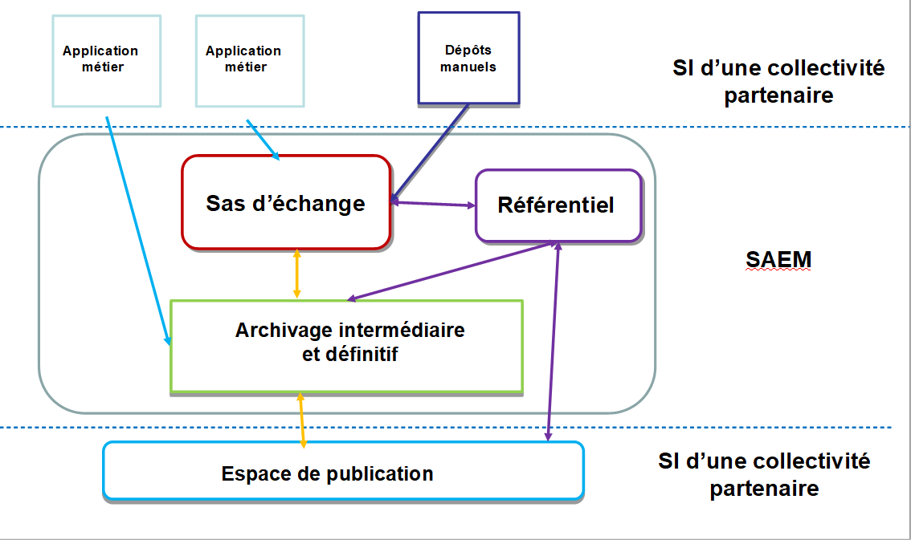
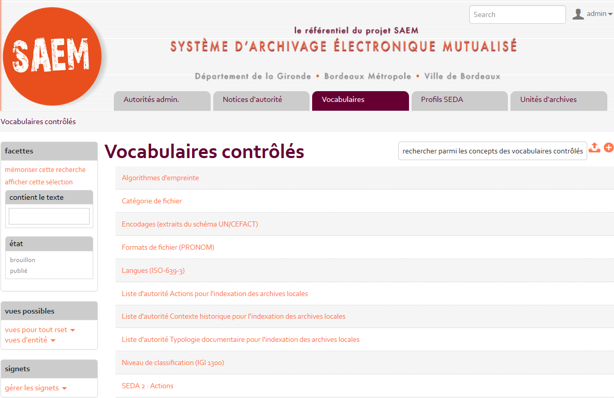

class: inverse, center, middle
background-image: url(./media/continuum.jpg)
background-position: top;
background-repeat: no-repeat;
background-size: contain;
.footnote[Ceci est fait en texte avec du logiciel libre]

# formation CD77
## avril-Mai 2018

### Au programme

1. Etapes du projet SAEM
2. périmètre fonctionnel
3. Démo
4. pratique
---
## Agenda
* Matin deuxième jour : démonstration du SAE Girondin et retours d'expériences
* Après-midi deuxième jour : Atelier pratique mon premier versement

.reduite2[]
---

---
## Tout ce que vous avez toujours voulu savoir sur le projet Girondin
.reduite[]
---
## Chronologie
* **2010** : Initiative du Conseil général de la Gironde de rechercher des partenaires pour mettre en place une plateforme d’archivage électronique mutualisée.
* **2011** : Réunions avec les grosses collectivités aquitaines, puis rencontres bilatérales et lancement du projet piloté par le Conseil général.
* La première priorité : définir le **cadre du partenariat** et les modalités d’**achat commun** de prestations. Pour chaque phase, rédaction d’une convention de partenariat comportant en annexe une convention de **groupement de commande**, votée par l’instance délibérante de chaque collectivité
.reduite[]
---
## Objectifs
* Mettre en place un partenariat exemplaire entre les membres fondateurs afin de mutualiser les expériences des partenaires et favoriser la montée en compétences de chacun,
* Optimiser et partager les coûts d’investissement des collectivités sur le prototypage d’un SAE,
* Construire ensemble une offre d’archivage électronique de confiance qui pourra être ouverte à d’autres utilisateurs autour des membres fondateurs.

---
## Orientations partagées
* Utiliser de **solutions libres** : Alfresco et As@lae pour le socle commun
* **Réutiliser** les développements réalisés par d’autres collectivités sur la 	plateforme cible
* **Reverser** les développements réalisés dans un espace accessible à tous
* Faire émerger un ensemble de **bonnes pratiques** basé sur le contexte 	normalisé (OAIS, SEDA, etc.)
* Permettre que le SAE puisse **recevoir** une grande variété d’archives
* Mettre en œuvre une **gouvernance des risques** conformément au RGS

---

## Les phases du projet
Découpage du projet en trois étapes
* phase 1 – **Étude et prototypage** à partir du socle Alfresco As@lae
* phase 2 – **Développements** complémentaires sur les briques du socles ou d’autres briques fonctionnelles, **études** complémentaires et rayonnement du projet
* phase 3 – **Exploitation puis généralisation** du système d’archivage électronique.

---
## Modalités de gouvernance
* Les **partenaires** : le conseil régional d’Aquitaine (phase 1), le conseil départemental de la Gironde, Bordeaux métropole, la ville de Bordeaux
* **Organisation** :
  * **Pilotage** assuré par le département
* **Instances** :
  * Comité projet (COPROJ) : un binôme chef de projet SI et chef de projet archives par collectivité
  * Comité technique (COTECH) : COPROJ + directeurs SI et archives
  * Comité de pilotage (COPIL) : COTECH + DGS
  * Commission d’homologation (RGS) : RSSI + directeurs SI et archives
  * Groupes de travail thématiques réunissant des experts en tant que de besoin
---
## Charges de gouvernance
* COPROJ réuni **deux demi journées** par semaine :
  * **planification** du travail et des livrables
  * répartition des sous-projet avec un porteur (product owner)
  * documentation systématique du projet et des réalisations (cr réunion + livrables écrits)
  * partage des documents dans un espace collaboratif sur Alfresco  structuré
  * **suivi** des relations avec les prestataires (points téléphoniques)

* COTECH réuni 2 fois par an pour prise de décisions
  * préparation d’un support par le COPROJ
  * partage des évolutions du projet avec les décideurs

* Autres instances de gouvernances
  * Comité de pilotage (COPIL) : COTECH + DGS
  * Commission d’homologation (RGS) : RSSI + directeurs SI et archives
  * Groupes de travail thématiques réunissant des experts en tant que de besoin  
---

## Ressources

* **techniques** : le Département met à disposition ses infrastructures pour les phases de construction de la solution.
Pour la mise en production, des infrastructures séparées (BM / Département) sont prévues.
* **humaines** :
 * chefs de projet du pilote (1 CPA et 1 CPSI) : 5 jours par semaine
 * chefs de projet partenaire  (1 CPA et 1 CPSI) : 3 jours par semaine
 * RSSI : 2 jours par mois

* **Cadre d’achat commun**  : un groupement de commande pour chaque phase (annexe des 2 conventions)

Le Département en est le coordonnateur (lance et valide les marchés)

Le Département et ses partenaires consomment le marché (commandes)
---
### Convention de partenariat

* Phase 1 :
  * Les travaux du Comité Projet ont débuté en décembre 2011
  * Délibérations de chaque collectivité entre avril et mai 2012
  * Signature de tous les partenaires en juin 2012
* Phase 2 :
  * Délibérations de chaque collectivité en juillet 2014
  * Signature de tous les partenaires en octobre 2014
* Phase 3 :
  * Délibérations des collectivités prévue début 2018
  * (modification des signataires en raison de la loi MAPTAM)

  
---
### Financement
Partagé à part égale entre les partenaires
* Phase 1 : 49 500 € TTC par collectivité
* Phase 2 : 225 000 € TTC par collectivité

* cinq subventions accordées par le SIAF dans le cadre des appels à projet AD-ESSOR
  * 2014 : 30 000 €
  * 2015 : 33 900 €
  * 2016 : 23 969 €
  * 2017 : 18 195 €
  * 2018 : 37 056 €

.reduite2[]
---
## Outillage

* **Infrastructures** techniques mises à disposition par le Département
* **Espace collaboratif** sur Alfresco pour le partage des documents et du planning mis à disposition par la métropole
* Espaces mis à disposition par les prestataires dans le cadre des marchés (cubicweb avec Logilab, Jira avec Atos)
* **Pad** prise de note partagé (framapad), **dépôt de source** et gestion de la **documentation en ligne** (framagit/readthedocs)

.reduite[]
---
## Espace documentaire

.reduite[]
---

## Méthode agile pour le développement
.pull-left[
.reduite[]
]
.pull-right[
.reduite[]
]

* Les individus et leurs interactions, de préférence aux processus et aux outils,
* Des solutions opérationnelles, de préférence à une documentation exhaustive,
* La collaboration avec les clients, de préférence aux négociations contractuelles,
* La réponse au changement, de préférence au respect d’un plan.

> Précisément, même si les éléments à droite ont de la valeur, nous reconnaissons davantage de valeur dans les éléments à gauche.

---
### L'expression des besoins...et leur priorisation
Rédactions en commun de users stories (US) : « en tant que (rôle).. je veux (fonctionnalité métier)… afin de (objectif)… » + critères d’acceptation pour tests

.reduite[]

---
### Le référentiel des besoins...en mouvement
* Alimentation du backlog par le Product Owner [JIRA](https://mtpl.bs.fr.atos.net/jira/)
* réunion de priorisation avec le COPROJ
* réunion de planification avec le(s) prestataire(s) : identification des tâches de développement et estimation de la charge
* sprint de développement : 2 semaines du lundi au vendredi, présentation du résultat au COPROJ ou COTECH (démo) et rétrospective (amélioration continue)

.reduite[]
---

## Réalisations et périmètre fonctionnel
* Des besoins fonctionnels à géométrie variable
* pas de solution disponible sur étagère

---
## Réalisations et périmètre fonctionnel

---
## Réalisation et bilan phase 1

* Passation du marché  
  * D’avril  à novembre 2012 : de la rédaction du marché au choix des prestataires
  * Notification du marché fin décembre
  * réunion de lancement début janvier 2013

* Un marché en 2 lots :
  * Lot 1 : étude détaillée, réalisation et mise en œuvre du socle technique commun (prototype).  
		Montant du lot 1 = 160 000 €HT.
  * Lot 2 : accompagnement à la définition de l’architecture technique cible et à l'identification des composants applicatifs nécessaires à l’archivage de flux de données conformément à la réglementation en vigueur (étude sécurité).
		Montant du lot 2 = 38 000 €HT.

---
## Phase 1 : prototype et études

.right-column[
* Flux d’archivage : délibérations (documents et vidéos) et marchés publics
* Modélisation des processus métiers archives
* Développement d’un module Alfresco open source
* Développement de web services avec as@lae
* Ecriture d’une politique de service d’archivage
* Réalisation d’une analyse RGS Ebios
* Rédaction d’un cahier de spécifications détaillées
* Réalisation d’une matrice fonctionnelle
* Développement des compétences internes
* Réflexion sur les modalités juridiques de mutualisation
]
.left-column[
* Coûts :
  * 50k€ par partenaire soit 200k€
  * 145 j de développement
  * 65 j d’études
  * 3j/sem pendant 1 an
* Audit de conformité :
  * 40% des exigences couvertes
]

.reduite2[]
---

### Phase 1 : Réalisation d'une matrice fonctionnelle
* Obtenir une vision complète de tous les besoins à couvrir dans un SAE digne de confiance
* Estimer le travail restant à réaliser
* Evaluer les charges et les budgets nécessaires
* Contenu de la matrice fonctionnelle :
  * 608 fonctionnalités issues des :
    * users stories
    * exigences SIAF, OAIS, NF 42-013
    * spécifications fonctionnelles (études complémentaires)
	* Réparties entre les 9 briques de la vision modulaire
	   * Classées par niveau de priorité
	    (bloquant / critique / important / mineur / trivial)
	   * Evaluées par niveau de complexité (simple / moyen / complexe) et coûts
---

#### Réalisation par phase : définition de la vision produit

---
## Réalisations phase 2
* Marché développements complémentaires - Conception et réalisation de modules open source pour un système d’archivage électronique multi-partenaires  (Marché AOO)
  * Montée de version d’Alfresco et As@lae, maintenance d’As@lae
  * Intégration des développements du prototype et évolution des fonctionnalités
  * Connecteurs avec le référentiel

* Choix du prestataire : Société ATOS avec ADULLACT Projet
* Montant du marché : sans minimum ni maximum
* Lancement du marché : mai 2015
---
# Réalisations phase 2
* Marché référentiel – Réalisation d’un référentiel de structuration et de gestion des métadonnées et des documents électroniques, développé en open source, prenant en compte le contexte normatif et basé sur une ontologie  (MAPA)

* Périmètre : créer, importer, centraliser, gérer et exposer
  * des vocabulaires contrôlés publics ou internes
  * des notices d’autorité des acteurs de l’archivage
  * des profils d’archivage conformes au SEDA (toutes versions)

* Choix du prestataire : Société LOGILAB
  * Montant du marché : Mapa (env. 200 000 €)
  * Lancement du marché : octobre 2014
---

### Réalisation et bilan phase 2
.pull-left[
* Phase 2 : développements
  * conception d’une ontologie SAEM
  * conception et réalisation d’un outil de gestion des référentiels de données pour l’archivage (vocabulaires, acteurs, profils)
  * développements de connecteurs entre les modules (OAI-PMH)
  * poursuite des développement du module Alfresco et des web services as@lae
  * rédaction d’une convention d’exploitation (phase 3)
]
.pull-right[
* Coûts :
  * 225k€ par partenaire soit 675k€
  * 245 j de développement
  * 3j/sem pendant 3 ans
Audit de conformité :
* 80% des exigences couvertes
]

.reduite2[]
---
### Le référentiel Girondin
.reduite[]
---
### Le référentiel Girondin
**Autorités administratives** : possibilité de créer des collectivités et leurs entités (basée sur l’ontologie Organization)

.reduite[]
---
### Ontologie saem

---
### Le référentiel Girondin
**Notices d’autorité** : possibilité de créer ou d’importer des notices d’autorité en XML EAC et de les associer à une autorité ou une unité administrative

.reduite[]
---

### Le référentiel Girondin
**Vocabulaires** : possibilité d’importer des vocabulaires (thésaurus et listes d’autorité SIAF) et d’en créer pour les besoins des métiers de chaque collectivité (ex : liste des lieux ou bâtiments)
.reduite[]
---
### Le référentiel Girondin
**Profils SEDA** et unités d’archives: création de profils et possibilité d’export et inspiration de la V2 du SEDA pour concevoir des unités d’archives réutilisables pour constituer des profils

.reduite[]

---
## La GED d'échanges
Tableau de bord d’un service versant

---
###  La GED d'échanges
Formulaire de versement

---
### Partage d'expériences
Assurer la cohérence et la complémentarité du projet SAEM avec d'autres projets en cours : le partage d'expériences

* échanges avec l’équipe VITAM
* participation au groupe de travail pré-versement SIAF
* participation au groupe de travail SEDA V2
* implication dans la feuille de route d'As@lae
* Alimentation du blog SAEM
* Collaboration avec le SIAF pour le développement d’un outil de conception de profil SEDA v2 à partir du référentiel SAEM (SHERPA)
---
## Retours d'expériences
* Complexité et technicité du sujet archivage électronique (montée en compétence continue)
* Arbitrages en mode mutualisé (convergences des visions)
* Evolution du paysage institutionnel (mutualisation)
* Multiplicité des prestataires qui complexifie la synchronisation des briques applicatives
* Charges humaines et durée du projet (renouvellement des équipes et pilotage à long terme, allongement des délais en raison d’un processus de décision freiné par la multiplicité de acteurs)
* Méthodologie du projet  : une  adaptation permanente (méthode Agile , outils de suivi de projet )
* Documentation du projet : une élaboration continue (cr coproj, études, schéma manuels utilisateurs)

---
### Démo

