class: inverse, center, middle
background-image: url(./media/continuum.jpg)
background-position: top;
background-repeat: no-repeat;
background-size: contain;
.footnote[Ceci est fait en texte avec du logiciel libre]

# formation CD77 
## avril-Mai 2018

### Au programme

1. Qu'est ce que l'archivage électronique
2. Démonstration et retours d'expérience
3. Mise en pratique
---

# Qui suis-je ?
.pull-left[
Agent public au département de la Gironde : j’ai coordonné plusieurs projets dans le domaine de l'ingénierie documentaire
(SAE, GED, Open data)

Facilitateur numérique : je contribue à renforcer le pouvoir d'agir des utilisateurs au travers d'un accompagnement aux usages (conscients) du numérique.

@keronos
]
.pull-right[

]
.footnote[(illustration : Moebius)]
---
## Tous dans le même bateau

## Corpus théorique

**Définitions**

> **Record management** : **organisation** des opérations permettant de **contrôler les processus** de production documentaire

> L’**archivage pérenne** des documents électroniques : **conservation** des documents et données et **des informations** qu’ils contiennent :
* Dans leur aspect physique comme dans leur aspect intellectuel
* Sur le très long terme
* De manière à ce qu’ils soient en permanence accessibles et compréhensibles

---
## L'archivage numérique comme processus dynamique 
<!--L'archivage numérique est donc un processus dynamique qui commence dès la création des documents.-->

|Critères|Archivage traditionnel|Archivage électronique|
|:----------------:|:-------------:|:-----------------------:|
|Pérennité|Qualité des supports et conservation d'un exemplaire unique|Écritures en multiples exemplaires, utilisation de formats informatiques non propriétaires, etc.|
|Intégrité|Méthodes de protection des objets (en limitant leurs sorties)|Catalogue des objets conservés, outils permettant de détecter toute modification des objets conservés|
|Sécurité|Contrôle des accès, protection des locaux et de leur contenu (contre l'incendie, les dégâts des eaux, les nuisibles, etc.)|Contrôle des accès physiques, protection des locaux (contre l'incendie, les dégâts des eaux, etc.), gestion des droits d'accès informatiques, administration du système, réplications, sauvegardes des systèmes, etc. |
---
## L'archivage numérique comme processus dynamique
|Critères|Archivage traditionnel|Archivage électronique|
|:----------------:|:-------------:|:-----------------------:|
|Traçabilité|Journal des événements|Journal des événements|
|Authenticité|Signature et date|Signature électronique, horodatage, calcul et gestion d'empreintes, etc.|
|Lisibilité / Intégrité|Implicite. Attention, certains documents peuvent s'estomper avec le temps (carbone, papiers chimiques, etc.)|Dispositifs matériels (lecteurs), formats de stockage, métadonnées spécifiques|
|Disponibilité|Organisation des moyens et des ressources|Organisation des ressources, plan de continuité, solutions de back-up, plan de reprise d'activité|

---

## Objectifs de l'archivage numérique

**L’archivage numérique pérenne n’est pas une sauvegarde.**

L’archivage pérenne du document numérique a 3 objectifs principaux :
.pull-left[
* conserver le document,
* le rendre accessible,
* en préserver l’intelligibilité.
]
.pull-right[
.reduite2[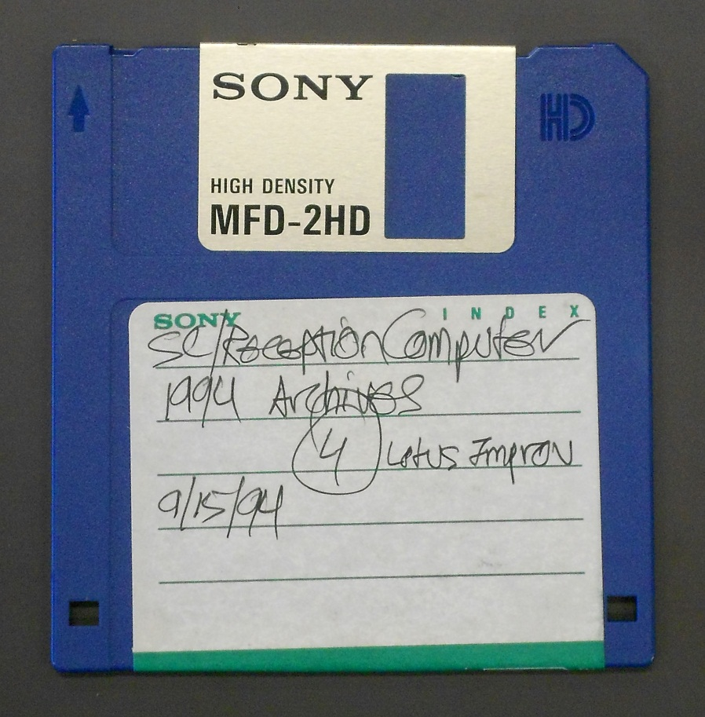]
.reduite2[]
]
---
## Les fondamentaux du besoin

Ces réflexions permettent d'introduire 3 notions fondamentales :
* authenticité et intelligibilité au travers des métadonnées descriptives
* environnement métériel
* environnement logiciel

| Problèmes     | solutions|
|--------------|:---------:|
|l’obsolescence matérielle   |conserver des copies multiples des documents archivés|
|l’obsolescence logicielle|dispositifs d’alertes de type veille technologique et économique|
|l’obsolescence du format de fichier|format dont les spécifications internes sont librement accessibles|
|la perte de la signification du contenu|métadonnées|

.footnote[source : le concept de l'archivage numérique pérenne [ressource Cines][cines]]

---

## Enjeux de l'archivage numérique
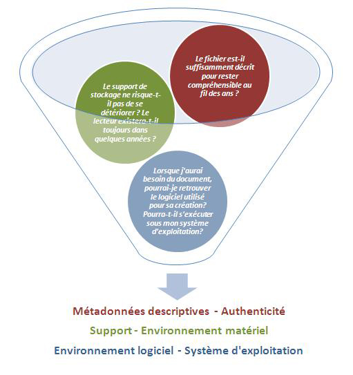
---
## Enjeux de la conservation numérique
<!--
C’est pourquoi l’archivage numérique/électronique est devenu un véritable enjeu pour les directions des systèmes d’information. Il s'inscrit dans une gestion "efficiente" de la gestion des données numériques par la prise en compte du cycle de vie de l’information ainsi que de la conservation pérenne des données à forte valeur juridique, stratégique et/ou patrimoniale qui sont souvent la seule trace de l'activité de l'administration. Leur perte constituerait à la fois un risque juridique et un risque majeur pour la continuité des activités. La notion d'« archivage électronique » renvoie par conséquent à celle de **« gouvernance des données numériques »**.
-->

---
## Gestion des activités documentaires

La **norme ISO 30300** dite "gestion des documents d'activité" permet d'inclure les aspects essentiels à la mise en place d'une **stratégie de gestion de la production documentaire** en reprenant des concepts issus des normes de gestion de la qualité :
* l’efficacité de toutes les activités « métier » d’une organisation,
* la **responsabilisation** de tous les acteurs,
* la gestion des **risques**,
* la **continuité** des opérations.

---

## Un petit détour par la vision processus

> **processus** : ensemble ordonnées d'activités qui délivre un produit et/ou un service, à un "client" interne ou externe, lui apporte de la valeur, répond à ses besoins exprimés ou implicites et nécessite d'être maîtrisé/piloté

> **processus métier** : ensemble des activités qui s’enchaînent pour créer un produit ou un service à partir d’éléments de base. Un processus se décompose en sous-processus. (MAC, glossaire de l'archivage)

---
## Modèle de processus

|Durée/date | Acteur 1 | Acteur 2 | Documents |
|------|:--------------------:|:-----:|:----:|
|04/12/2017|Action 1 --->|Action 2|Version 0.1|
|04/12/2017|Action 3||version 0.2|
---
## Macro-processus de RM

.pull-left[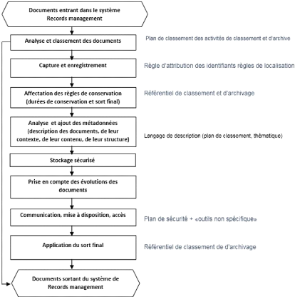]
.pull-right[.reduite[]]

---
class: center, top
## Modélisation d'un processus
1. On commence par définir les diagrammes de cas d'utilisation (Use Case)

<!--
Qui permettent de donner une vue globale de l'application. Pas seulement pour un client non avisé qui aura l'idée de sa future application mais aussi le développeur s'en sert pour le développement des interfaces.

La représentation d'un cas d'utilisation met en jeu trois concepts : l'acteur, le cas d'utilisation et l'interaction entre l'acteur et le cas d'utilisation.

Cas d'utilisation : Un cas d'utilisation (use case) représente un ensemble de séquences d'actions qui sont réalisées par le système et qui produisent un résultat observable intéressant pour un acteur particulier

-->

---
class: center, top

## Modélisation d'un processus

2. Ensuite on va présenter la chronologie des opérations par les diagrammes de séquences.

---
class: center, top
## Modélisation d'un processus

3. Et finir par les diagrammes statiques, qui sont celles de classe de conception, de classe participantes et le modèle physique.
]

.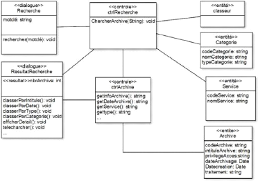
---

## Organisation
.pull-left[
La dématérialisation produit ou renforce de nouveaux processus :
* Gestion des **droits** : la mise à jour de l'annuaire devient critique
* Gestion des **circuits** / processus dématérialisés
  * maintenance,
  * nouveaux processus,
  * adaptation vs réorganisation, ...
* Gestion des **référentiels** de métadonnées : outils et correspondants métiers sont essentiels

]
.pull-right[]

.footnote[Illustration: Edwin D. Babbitt’s The Principles of Light and Color (1878) — [Source](https://archive.org/details/gri_c00033125011227010).]
---

## Organisation
.pull-left[
* Gestion de l'enrichissement des documents grâce aux référentiels : comment les utilisateurs enrichissent leurs documents, à quelle dose, comment ?
* Gestion de la **contribution** des utilisateurs aux référentiels
* Gestion documentaire: les basiques du classement et des fonctionnalités associées.
* La **recherche** d'information :c'est un processus qui doit être clair pour les utilisateurs.
* Le travail **collaboratif** : méthodologie à mettre en place.
* **Architecture** de l'information : un nouveau métier, une fonction dédiée ?

]
.pull-right[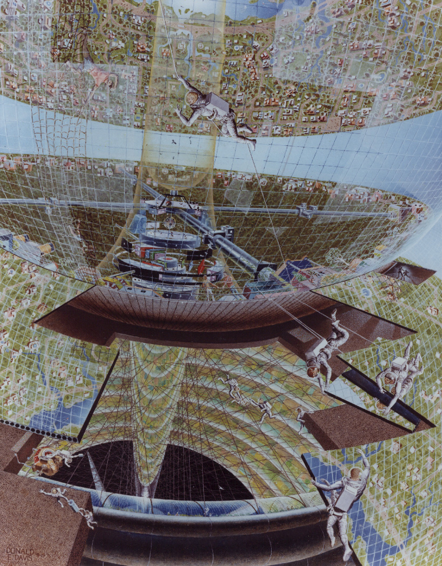]

.footnote[Illustration: NASA Ames Research Center (1970) — [Source](https://settlement.arc.nasa.gov/70sArt/art.html).]

---

## Collectivisation de la production
Proposer de passer d'une logique de gestion **individuelle inconsistante, éphémère et isolée** à une logique de gestion **collective organisée, contrôlée et partagée**

---

## Cycle de vie des documents engageants (records)
  * problématique de nommage
  * versionnage
  * copie
  * validation
  * validité

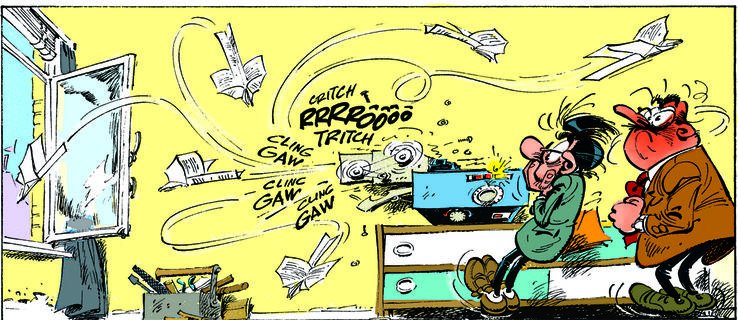

---

## Continuum information

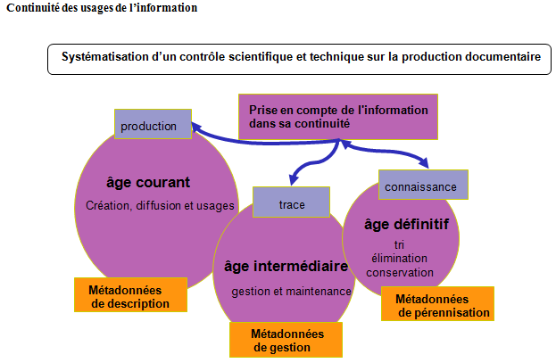

---

## La gestion de l'archivage
### production vs. conservation
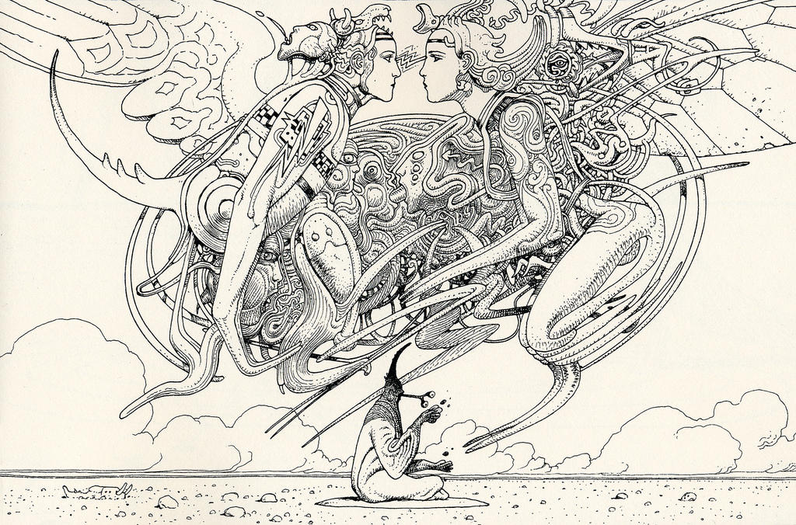
---

## Parallélisme des âges
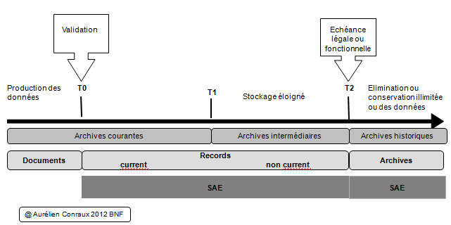
---
## Qualifier et classer l'information numérique : caractéristiques internes et externe
.pull-left[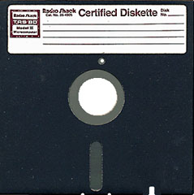]
.pull-right[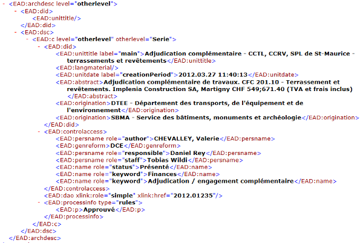]

---

### Caractéristiques internes
.pull-left[
* nom (identifiant)
* titre
* description
* date de création
* date de dernière modification
* auteur (contexte de production)
* format
* indexation
* somme de contrôle
]
.pull-right[]
---

### Caractéristiques externes
.pull-left[
* version
* classification de diffusion
* classification de publication
* sort final
* DUA
* signature
]
.pull-right[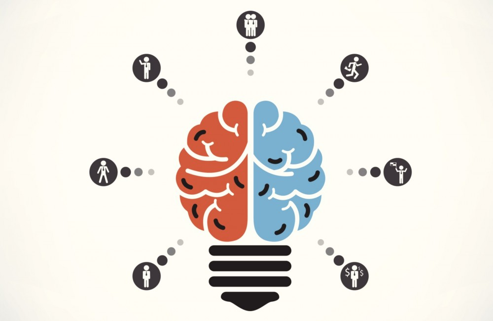]

---

## Contraintes réglementaires et risques
### Archiver pour prouver et pour tracer

.pull-left[
* transfert de responsabilités
* stockage sécurisé
* gel de l'original
* journal des événements
]
.pull-right[]
---
## La gestion des risques

* éviter que des documents/données ne soient pas archivés
* éviter que des données/documents soient modifiés
* trouver facilement l'information
* éviter que des documents/données ne soient détruits trop tôt
* éviter que des documents/données soient conservés trop longtemps

.reduite[]
---

## Gestion de la qualité
Le records management impose aux producteurs de documents de considérer le document, quel que soit son support, **dès sa création**, en fonction des **différentes valeurs** qu’il peut avoir et **des fonctions** qu’il remplit.

---

## Enjeux pour l'organisation

### Performance et connaissance

* Réduire les coûts : **conserver efficacement** les informations critiques  et y accéder rapidement
* Se conformer à la **règlementation**

--
* Le capital immatériel de la collectivité est un **levier majeur** de la chaîne de valeur
* Il répond à un besoin croissant de **collaboration et de communication**
* Il faut mettre en place les moyens pour **exploiter avec efficience** ces contenus

---
## Enjeux pour l'organisation

### Risques juridiques et financiers
.pull-left[
* Coût global de stockage qui s’élève
* Coûts passé à rechercher et à extraire les données
* Un éparpillement dans des outils différents
* Pas de « référentiels »
* Une gestion désordonnée entraîne des pertes de temps et d’informations
* Pas de capitalisation de la connaissance commune
* Perte d’identité et contentieux
]
.pull-right[
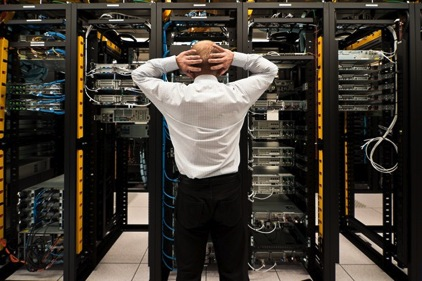]
---

## Evaluation de la production
Le but du records management est de **lier un document à l'activité qui l'a produit et au contexte dans lequel il a été créé** avec des moyens suffisants pour qu'il puisse ultérieurement être **accepté comme authentique** et représentatif de l'information d'origine.

---

## Certification de la production
.pull-left[
Le mécanisme de signature doit permettre (selon art. 1316-1 du Code civil) :

* **d’identifier / authentifier** l’auteur d’un document (traçabilité)
* de **garantir** que l’auteur a bien émis ce document et pas un autre
(intégrité : le document n’a pas été altéré entre l‘émission et le moment où le lecteur le consulte)
]
.pull-right[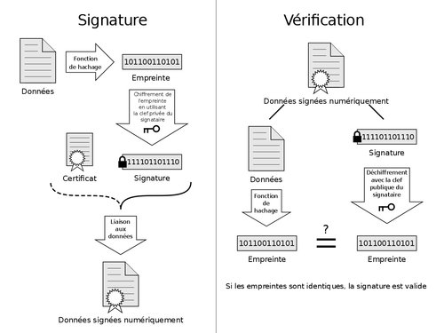]
---

## Gestion de la preuve
> Intégrité : le respect cumulé de trois critères
* la lisibilité du document
* la stabilité du contenu informationnel
* la traçabilité des opérations sur le document

Dans la mesure où devant le juge, se posent les questions de recevabilité et de force probante des documents électroniques archivés, les critères de l’intégrité doivent impérativement être édictés afin de permettre de définir les conditions dans lesquelles un document conservé pourra avoir valeur probante.

---

## Gouvernance documentaire
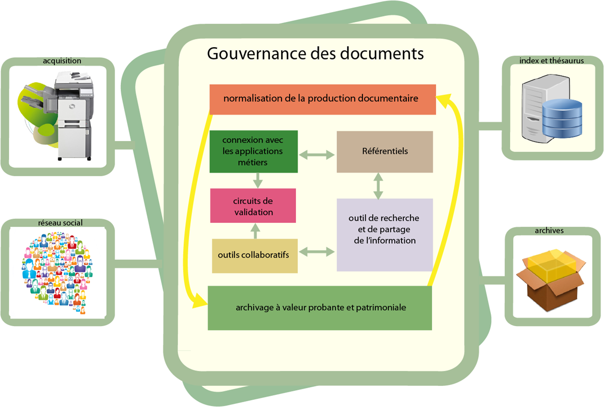

---

## Gestion transverse de l'information
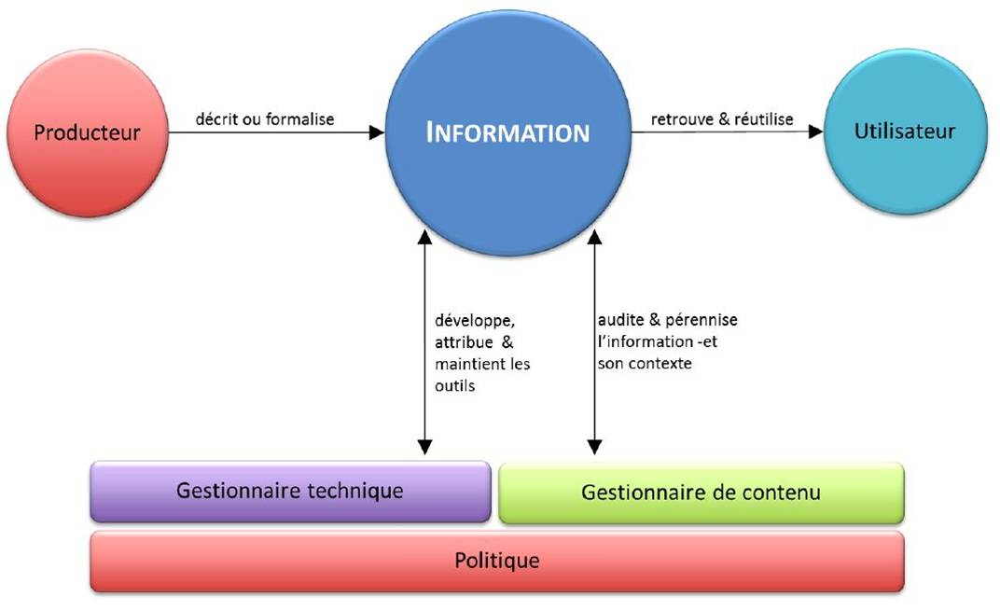

---

## Moyens transverses
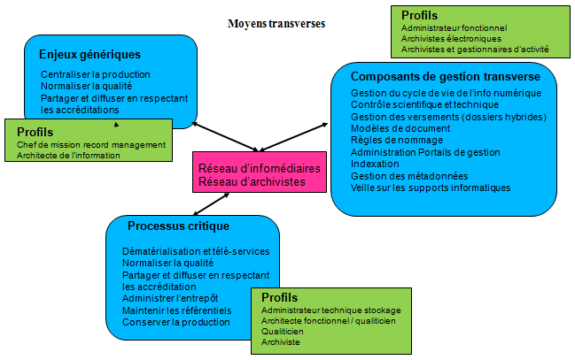

---

## Politique de gestion de l'information
>Définition du cycle de vie de l'information
-> une analyse des **processus** de travail  + **réglementation** + **besoins** de gestion

* **Identification** des documents liés à la continuité de l’activité
* Définition des **durées de conservation**
(combien de temps les documents seront-ils nécessaires) ? À partir de quel moment peut-on les détruire ?)
* Définition des règles de **communicabilité**
(quel est le délai pour rendre une information librement accessible à tous ?)

---

## Les 3 âges électroniques

---

## La politique d'archivage électronique
.reduite[]
---
## Référentiel documentaire PA

* **PSA/PA** : politique de service d'archivage / politique d'archivage
* **MOO** : mise en oeuvre opérationnelle
* **DPA** : déclaration des pratiques d'archivage (vise ensuite à définir comment l'AA s'organise pour répondre aux objectifs et engagements de la (des) PA ainsi qu'à identifier les procédures opérationnelles et les moyens mis en œuvre pour cela)
* **PSSI** : politique de sécurité des systèmes d'informations

[ressource complémentaire SSI](https://www.ssi.gouv.fr/archive/fr/confiance/documents/methodes/ArchivageSecurise-P2A-2006-07-24.pdf)

---

## Gestion

---

### Les métadonnées de pérennisation

---

#### Introduction sur les Métadonnées en général
**définition**
> Une métadonnée est une donnée servant à **définir ou décrire** une autre donnée. **Porteuse d'information** sur le **contexte**, le **sens** et la **finalité** de la ressource informationnelle portée par la **donnée brute**.

---

### Structuration de l'information
La structuration de l’information est la clé qui assure la versatilité des usages qui peuvent être capitalisés à partir d’un même processus de description

---

## Le modèle d’information de l’OAIS
### L'objet information

.pull-left[
l’Objet Information est composé d’un **objet données**
(physique ou numérique) et de l’information de représentation qui permettent d’interpréter les données sous la forme d’une **information compréhensible**.
]
--
.pull-right[.reduite[]
]
---

**l'information de représentation**

.pull-left[
Basée sur la récursivité, elle permet de représenter les différentes composantes de l'information

]
--
.pull-right[
**Composition**

Elle peut être composée des typologies suivantes :
* **Information de structure** :
types de données courants en informatique, comme des caractères, des nombres, des pixels, des tableaux

* **Information sémantique** :
informations complémentaires associées aux éléments de structure, telles que la langue dans laquelle l’objet est exprimé, les opérations réalisables sur chaque type de données et leurs relations, etc.

* **Autres**:
Identifiants d’autres standards comme la référence à la norme ASCII
]
---

**L'information de pérennisation**

.pull-left[
Elle doit permettre d'expliciter le contexte de production

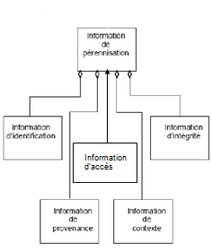
]
--
.pull-right[
Elle peut être composée des typologies suivantes :

* **Information de provenance** : décrit l’origine du contenu d’information, qui en a la charge, et quel est l’historique de ses modifications

* **Information de contexte** : décrit comment le contenu d’information s’articule avec d’autres informations à l’extérieur du paquet

* **Information d’identification** : fournit un ou plusieurs identifiants ou systèmes d’identification

* **Information de droits d’accès** (Access Rights Information) : information qui identifie les restrictions d’accès portant sur l’information de contenu

* **Information d’intégrité** : protège le contenu d’information contre les altérations non documentées
]

---

## Mise en oeuvre
.reduite[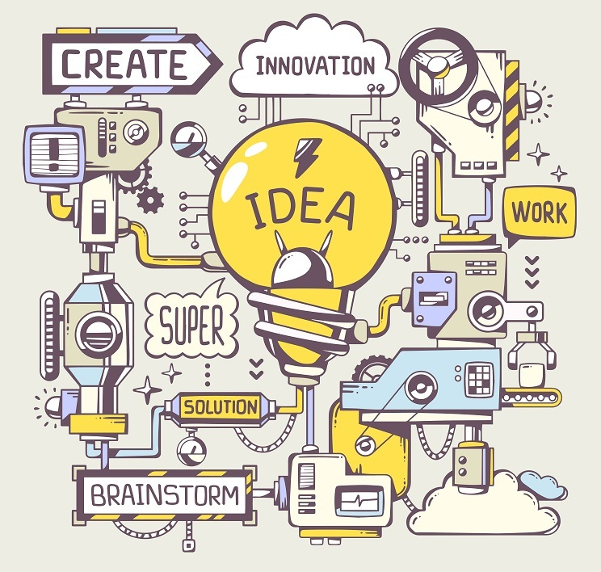]
---

## Mise en oeuvre opérationnelle
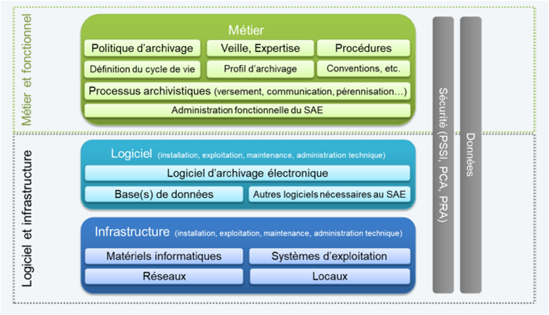
---
## La vision SAEM Girondin

---

### Par où commencer ?

|étape | solutions applicatives          | solutions humaines | documentation |
|------|:--------------------:|:-----:|:----:|
|première étape|stockage organisé et documenté|gestion de la conservation|politique d'archivage|
|cible intermédiaire|Données de référence / SAE|gestion des référentiels / gestion de la conservation|guide bonnes pratiques / politique d'archivage|
|cible RM|Ged|gestion de la production courant / identification des records|guide de nommage / indexation|
|cible SAE|Référentiel / GED / SAE|gestion des référentiels / record manager / gestion de la conservation|politique de gestion des données / politique d'archivage / Politique de gestion du SI|

---

### Le lean canvas pour itérer sur la vision
1. Identifier les parties prenantes (éventuellement les premiers utilisateurs de la solution mise en place)
2. Identifier leurs problèmes (et les solutions (de contournement) qu’ils utilisent)
3. Identifier les solutions disponibles
4. Identifier les critères d’évaluation de la valeur apportée par la solution envisagée
5. Identifier les critères de légitimité du(des) porteur de projets
6. Identifier les canaux de communication mobilisables pour faire parler de son projet
7. Identifier le concept à haute valeur ajoutée et la proposition de valeur associée au projet
8. Identifier les coûts
9. Identifier les revenus ou les gains

---

### Choix du scenarii en fonction :

* des ressources humaines nécessaires,
* des moyens techniques à mobiliser,
* des moyens financiers à prévoir,
* de la volonté stratégique,
* la maturité vis-à-vis du numérique et des archives.

 et pour les acteurs publics de **l’environnement institutionnel et du contexte territorial**

---
class:center,top
### Cas de figure : commune
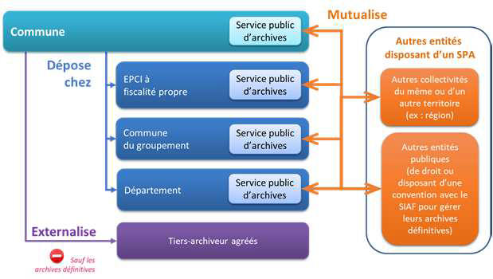

---
class:center,top
### Cas de figure : EPCI
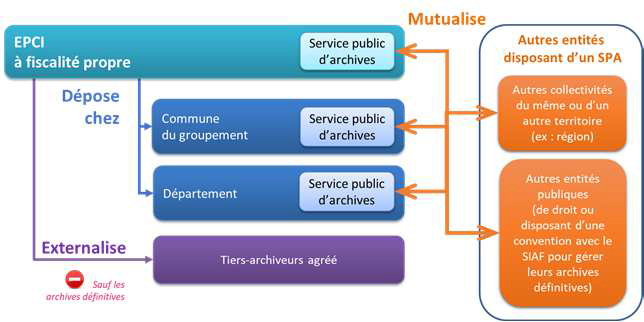

---
class:center,top
### Cas de figure : EPL
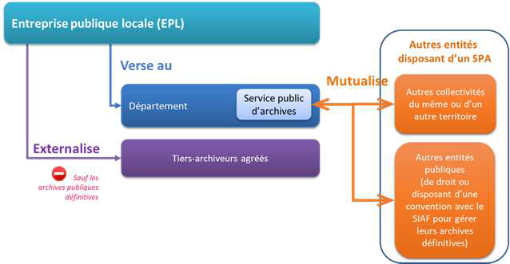
---
class: center,top
### Votre projet : version classique

---
class: center, top
### MVP

<!--
* « Logiciel fonctionnel plutôt que documentation complète » : il est vital que l'application fonctionne. Le reste, et notamment la documentation technique, est secondaire, même si une documentation succincte et précise est utile comme moyen de communication.

* « Collaboration avec le client plutôt que la négociation du contrat » : le client doit être impliqué dans le développement. On ne peut se contenter de négocier un contrat au début du projet, puis de négliger les demandes du client.

* « Réagir au changement plutôt que suivre un plan » : la planification initiale et la structure du logiciel doivent être flexibles afin de permettre l'évolution de la demande du client tout au long du projet.

-->
---
### exercice
1. Remplir le canvas pour mettre en place votre première itération

2. [correction](corrigeExercice.md)
4. [correction sae](corrigeExercice.md)
---
### Rétrospective
2. Les points satisfaisants
3. les points à améliorer

A votre disposition pour en parler :
* par mail : p.romain@gironde.fr
* sur twitter : @keronos

Pour en savoir plus sur le projet SAEM :
[le blog du SAEM](http://saem.e-bordeaux.org/blog)

**Merci pour votre attention !**
