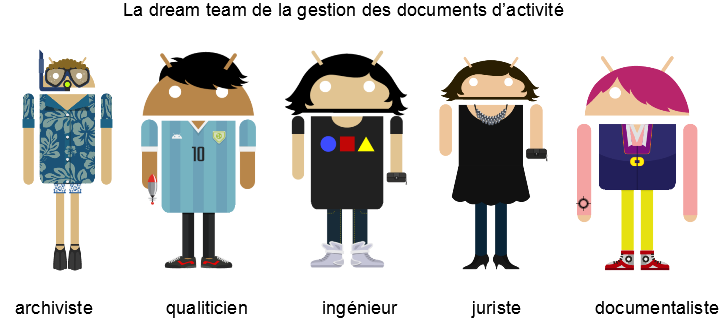

class: inverse, center, middle
background-image: url(./media/continuum.jpg)
background-position: top;
background-repeat: no-repeat;
background-size: contain;
.footnote[CC-By-SA Keronos Entertainment. Ceci est fait en texte avec du logiciel libre]

# formation AD79
## Mai 2018

### Au programme

1. choisir une quête
2. identifier les scenarii possible
3. jouer
4. évaluation
---
## Agenda
* C'est quoi l'archivage électronique
* Choix du rôle
* Réaliser la quête
* Partage et rétrospective

.reduite2[]
---
## Retrospective
.reduite[]
---
class: center

## Jeu dont vous êtes les héroïnes (ou les héros)
Mettre en production un SAE et faire de l'archivage électronique (un truc de dingue!)

Saurez-vous apprivoiser les jargons techniques et collaborer pour déjouer la complexification abyssale de notre jungle administrative afin d'offrir des données structurées et contextualisées à vos adorateurs.trices immémorielles ?

Constituez des équipes avec au moins un représentant de 2 entités OAIS puis choisissez votre terrain de jeu parmi les différents contextes de jeu.

Parcourer les étapes de la mise en oeuvre d'un processus d'archivage jusqu'à la restitution de dossiers de marchés publics et votre destination sera atteinte.

Choisir un [rôle](#heros) dans l'OASIS (pardon [OAIS](#oais)!)
---
name: oais
### L'Ouverture des Archives Intelligible et Sécurisée (OAIS)

Consultez les [règles du jeu](#regles) puis placer les [rôles](#heros) présents dans votre équipe sur le schéma en fonction du [contexte de jeu](#scenarii)
---
name: heros
### les héros (ou l'héroïne) de l'archivage électronique
* Entité Conservation et collections
  * [archiviste](#archiviste)
  * [cartographe des producteurs](#cartographe)
  * [serial indexeur](#indexeur)
  * [chargé de traitement de versement](#traitement)
  * [chargé de valorisation d'archives numériques](#valorisation)
* Entité Entrées et traitements
  * [profileur de versement](#profileur)
  * [accompagnateur de versement](#accompagnateur)
  * [chargé d'accueil de versement](#accueil)
* Entité planification
  * [plombier numérique](#plombier)
  * [urbaniste de la dématérialisation](#urbaniste)
  * [aiguilleur de la dématérialisation](#aiguilleur)
  * [référent archivage numérique](#referent)
* Entité stockage
  * [superviseur de dépôt numérique](#superviseur)

Rédiger votre fiche de poste [fiche de poste vierge](#vierge)

Placer sur la [carte OAIS](#oais) les rôles de l'équipe et choisir une [quête](#quete) à adapter en fonction de votre [contexte](#scenarii) de jeu
---
name: regles
class: center

### Règles du jeu
Par équipes de 3,4 vous devrez mener à bien votre quête en parcourant les forêts mystérieuses de la dématérialisation administrative.

Vous pouvez vous aider de la [bibliothèque de référence pour l'archivage numérique](https://francearchives.fr/fr/article/26287443) et de la présence d'un [facilitateur numérique](#facilitateur) pour réaliser vos missions.

Consulter la [carte de la quête](#carte) et se poser les [bonnes questions](#mvp-question) pour démarrer. Se rendre sur la page de [choix de la quête](#quete)
Si vous êtes perdu vous pouvez [réviser](slideshow.html)
.reduite2[]
---
name: carte
class: center, middle

### Carte au trésor du pays de la théorie

Au pays de la théorie, plusieurs projets sont en production et archivent quantités de données de manière totalement automatisée dans une forteresse inprenable.

Après avoir choisi votre [quête](#quete), votre [contexte](#scenarii) et vos [compagnon.nes](#heros), tentez de rejoindre le pays de la pratique en établissant un [plan](#architecture) et en organisant une [équipe](#organisation)
---
name: mvp-question

### Les bonnes questions pour démarrer
1. Identifier les parties prenantes (éventuellement les premiers utilisateurs de la solution mise en place)
2. Identifier leurs problèmes (et les solutions (de contournement) qu’ils utilisent)
3. Identifier les solutions disponibles
4. Identifier les critères d’évaluation de la valeur apportée par la solution envisagée
5. Identifier les critères de légitimité du(des) porteur de projets
6. Identifier les canaux de communication mobilisables pour faire parler de son projet
7. Identifier le concept à haute valeur ajoutée et la proposition de valeur associée au projet
8. Identifier les coûts
9. Identifier les revenus ou les gains

Revenir à la page précédente
---
name: quete
class: center

## Choix de la quête
En fonction de votre niveau d'expertise, de vos besoins ou de votre contexte vous pouvez choisir une quête parmi celles-ci.

.pull-left[
]
]
.pull-right[

* [quête experte](#quete-experte) : vous devrez automatiser le processus de versement des marchés publics gérés par la direction de la commande publique.
* [quête archiviste](#quete-archiviste) : vous devrez préparer et effectuer avec votre direction de la commande publique un versement d'un marché notifié et effectuer différents opérations de traitement.
* [quête archiviste itinérant](#quete-itinerante) : vous devrez accompagner un service d'archives constitué dans le choix d'un scenario d'archivage électronique.
]

Au besoin consultez les [règles du jeu](#regles) puis placez les [rôles](#heros) présents dans votre équipe sur le schéma en fonction du [contexte de jeu](#scenarii)
---
name: quete-experte
### équipe experte
.left-column[.reduite[]]
.right-column[
Verser les dossiers de marchés publics notifiés depuis la GED dans le SAE intermédiaire et verser les pièces à conserver dans le SAE définitif

* [ressource pédagogique](https://www.economie.gouv.fr/daj/ouverture-des-donnees-commande-publique)

#### Les étapes
1. Identifier la source de production
2. Identifier les données essentielles
3. construire la table de concordance
4. écrire le [contrat de versement](#contrat-versement)
5. écrire le [profil](#profil)
6. effectuer un [versement](#versement-marche)

Si vous êtes prêts, aller à la page [architecture](#architecture)
Au besoin consultez les [règles du jeu](#regles) puis placez les [rôles](#heros) présents dans votre équipe sur le schéma en fonction du [contexte de jeu](#scenarii)

]

---
name: quete-archiviste

### équipe archiviste
.left-column[.reduite[]]
.right-column[
Effectuer un versement d'un marché public notifié et préparer l'instrument de recherche pour pouvoir le communiquer en salle de lecture.

* [ressource pédagogique](https://www.economie.gouv.fr/daj/ouverture-des-donnees-commande-publique)

#### Les étapes
1. écrire le [profil](#profil)
2. écrire le [contrat de versement](#contrat-versement)
3. associer le [service versant au profil](#association-profil)
4. mettre à jour la [politique d'archivage](#politique-archivage)
5. [verser un marché](#verser-marche)
6. [éliminer les pièces éliminables](#eliminer-marche)
7. [communiquer les pièces communicables](#communiquer-marche)
8. [restituer le versement](#restituer-marche)

aller à la page [organisation](#organisation)
Au besoin consultez les [règles du jeu](#regles) puis placez les [rôles](#heros) présents dans votre équipe sur le schéma en fonction du [contexte de jeu](#scenarii)

]

---
name: quete-itinerante

### équipe itinérante
1. Je suis une municipalité de Seine-et-Marne et je veux archiver électroniquement mes marchés publics :
2. Je suis la DREAL et je veux archiver les dossiers de classement des établissements dangereux pour la période 2008-2018
3. Je suis la communauté de commune du Val d'Oise et je veux archiver mes flux comptables dématérialisés
4. Je suis la direction archives du département du Val d'Oise et je veux archiver les dossiers d'action sociale gérés dans l'application métier

Vous devez conseiller ces différents partenaires en fonction de leur situation et produire une note détaillée à votre direction.

Aller à la page [scenarii d'archivage](#scenarii) puis choisissez votre plan d'[action](#action)

Au besoin consultez les [règles du jeu](#regles) puis placez les [rôles](#heros) présents dans votre équipe sur le schéma en fonction du [contexte de jeu](#scenarii)

---
name: architecture
### Architecture du cycle de vie des marchés publics
.left-column[.reduite[]]
.right-column[
Afin de prendre en compte la globalité du cycle de vie des archives, il est essentiel d'identifier la ou les sources de production afin de déterminer les événements déclencheurs qui peuvent justifier du passage des données ou documents d'un entrepôt à un autre.
> Ce travail est également requis dans le cadre de la mise en place du RGDP en intégrant l'identification des données à caractère privé.

1. identifier les sources de production
2. identifier les acteurs du processus
3. dessiner votre carte de flux
4. identifier les étapes et les lieux du processus

aller à la page [organisation](#organisation)

Au besoin consultez les [règles du jeu](#regles) puis placez les [rôles](#heros) présents dans votre équipe sur le schéma en fonction du [contexte de jeu](#scenarii) et de la [quête](#quete) poursuivie

]

---
name: organisation

### Organisation pour la gestion du cycle de vie de l'information
Afin de mener à bien votre quête vous devrez constituer une équipe compétente et complémentaire. Vous devrez évaluer leur disponibilité afin d'ajuster l'organisation et le planning de réalisation associé à vos projets. Le cas échéant vous devrez rédiger des fiches de postes pour recruter les compétences ou les ressources manquantes.

.reduite2[]

1. identifier les [ressources](#heros) existantes
2. identifier les ressources mobilisables
3. dessiner la [cartographie](#oais) des compétences
4. écrivez les [fiches des postes](#vierge) manquantes

allez à la page [scenarii](#scenarii)

Au besoin consultez les [règles du jeu](#regles) puis placez les [rôles](#heros) présents dans votre équipe sur le schéma en fonction de la [quête](#quete) poursuivie

En fonction de votre choix, mettez votre organisation en [action](#action)
---
name: scenarii

### scenarii

* internalisation : aller à la page [internalisation](#internalisation)
* dépôt au sein d'un EPCI : aller à la page [dépôt en EPCI](#externalisation-epci)
* dépôt au Département : aller à la page [dépôt aux AD](#externalisation-ad)
* mutualisation entre services publics d'archives : aller à la page [mutualisation SPA](#mutualisation-spa)
* externalisation : aller à la page [tiers archiveur privé](#externalisation-tiers)

Au besoin consultez les [règles du jeu](#regles) puis placez les [rôles](#heros) présents dans votre équipe sur le schéma en fonction du [contexte de jeu](#scenarii) et de la [quête](#quete) poursuivie

Une fois choisi votre contexte, choisissez votre plan d'[action](#action)
---
name: action

### mise en oeuvre
* Vous avez déjà un SAE, [rédigez un profil](#profil) pour préparer le modèle de versement
* Vous voulez automatiser le versement, [définissez les modalités](#automatisation) d'automatisation d'un connecteur
* vous voulez concevoir un SAE, [définissez vos besoins](#conception-sae)

Au besoin consultez les [règles du jeu](#regles) puis placez les [rôles](#heros) présents dans votre équipe sur le schéma en fonction du [contexte de jeu](#scenarii) et de la [quête](#quete) poursuivie
---
name: automatisation
### Concevoir un connecteur applicatif
Un connecteur applicatif est un processus qui prend en entrée des données et des documents et qui les transmets à une autre application, lorsque survient un événement déclencheur, afin de les transformer dans un format cible.

Par exemple, l'application de publication des marchés publics du département extrait les données relatives à la phase de passation, lorsque le marché est notifié et l'acte d'engagement légalisé, et les dépose dans un dossier d'une GED ou sous la forme d'un bordereau SEDA directement à un SAE.

* depuis une [application métier](#automatisation-metier)
* depuis une [GED](#automatisation-ged)

Si finalement vous préférez effectuer un versement manuel, retournez à la page [rédaction du profil](#profil) de versement

Au besoin consultez les [règles du jeu](#regles) puis placez les [rôles](#heros) présents dans votre équipe sur le schéma en fonction du [contexte de jeu](#scenarii) et de la [quête](#quete) poursuivie

---
name: internalisation

### internalisation :
L'internalisation de la fonction archivage électronique nécessite une collaboration entre une autorité d'archivage et un opérateur d'archivage à l'intérieur de l'organisation. Découvrez les forces et les faiblesses de ce scenario pour voir s'il vous convient.

* aller à la page [sc-interne](#sc-interne)

Au besoin consultez les [règles du jeu](#regles) puis placez les [rôles](#heros) présents dans votre équipe sur le schéma en fonction du [contexte de jeu](#scenarii) et de la [quête](#quete) poursuivie

---
name: externalisation-tiers

### externalisation AI :
La réglementation définie par le Code du Patrimoine permet d'effectuer une externalisation des archives chez un prestataire privé.

Cette externalisation, toutefois, ne peut concerner que les archives intermédiaires et doit faire l'objet d'un marché public.

Pour connaître les forces et les faiblesses de ce scenario, aller à la page [sc-depot-tiers](#sc-depot-tiers)

Au besoin consultez les [règles du jeu](#regles) puis placez les [rôles](#heros) présents dans votre équipe sur le schéma en fonction du [contexte de jeu](#scenarii) et de la [quête](#quete) poursuivie

---
name: externalisation-epci

### externalisation AI et AD :
Pour une commune il est possible de d'adresser à une communauté de commune ou à une commune du groupement afin de consommer un service d'archivage électronique.

Pour connaître les forces et les faiblesses de ce scenario, aller à la page [sc-depot-EPCI](#sc-depot-EPCI)

Au besoin consultez les [règles du jeu](#regles) puis placez les [rôles](#heros) présents dans votre équipe sur le schéma en fonction du [contexte de jeu](#scenarii) et de la [quête](#quete) poursuivie

---
name: externalisation-ad

#### externalisation en AD :
Pour une commune ou une communauté de commune il est possible d'effectuer des dépôts d'archives électroniques dans l'entrepôt de conservation des archives départementales si celle-ci dispose d'un service d'archivage électronique.

Pour connaître les forces et les faiblesses de ce scenario, aller à la page [sc-depot-AD](#sc-depot-ad)

Au besoin consultez les [règles du jeu](#regles) puis placez les [rôles](#heros) présents dans votre équipe sur le schéma en fonction du [contexte de jeu](#scenarii) et de la [quête](#quete) poursuivie

---

name: mutualisation-spa

### mutualisation entre service public d'archives :
Pour une commune, une communauté de commune ou un département il est possible de mettre en place une convention de partenariat afin de mutualiser le service d'archivage électronique.

Pour connaître les forces et les faiblesses de ce scenario, aller à la page [sc-depot-spa](#sc-depot-spa)

Au besoin consultez les [règles du jeu](#regles) puis placez les [rôles](#heros) présents dans votre équipe sur le schéma en fonction du [contexte de jeu](#scenarii) et de la [quête](#quete) poursuivie

---
name: sae-existant

### j'ai déjà un SAE :

Vous disposez déjà d'un SAE. Vous pouvez soit effectuer un versement en rédigeant un profil ou convenir au préalable d'un contrat de versement avec le service versant. Dans tous les cas, vous devez mettre à jour votre politique d'archivage pour y inscrire le flux pris en charge et ses modalités d'archivage

Au besoin consultez les différents [contexte de jeu](#scenarii) et identifiez les [rôles](#heros) nécessaires à votre [quête](#quete)

---
name: profil

### écrire le profil
Ce profil doit contenir plusieurs unités de description : un dossier de consultation des entreprises, un dossier de publicité, un dossier de notification, un dossier contenant les offres et éventuellement un dossier contenant l'exemplaire unique légalisé.

Il doit contenir les règles de sort final, de DUA et de communicabilité et les données définies dans le référentiel du ministère de l'économie dans l'arrêté du 14 avril 2017 relatif aux données essentielles dans la commande publique (https://www.economie.gouv.fr/files/files/directions_services/daj/marches_publics/ouverture-donnees/referentiel_marches_publics.pdf)

Une fois ce profil réalisé, vous pouvez l'[associer](#association-profil) à l'entité administrative qui va en effectuer le [versement](#versement).

retournez à la [liste des étapes](#quete-archiviste) de votre quête
---
name: contrat-versement

### écrire le contrat de versement avec la direction des marchés
Les modalités d'échanges avec les services consommateurs du service d'archivage électronique doivent être définies dans un document contractuel qui précise notamment la fréquence prévisionnelle des versements, leur contenu, leur volumétrie, les formats de fichier et les conditions de communication ou d'élimination.

Rédigez le contrat de versement de la direction de la commande publique en vous inspirant du [modèle du SIAF](./ressources/BDR_04_Contrat_de_versement_sans_notice.odt)

Retranscrivez ces éléments dans votre [politique d'archivage](#politique-archivage)

retournez à la [liste des étapes](#quete-archiviste) de votre quête
---
name: politique-archivage

### mettre à jour le référentiel de la politique d'archivage
La politique d'archivage est le document qui établi les responsabilités entre les différents acteurs du service d'archivage électronique et précise les offres de service associées.

A partir des éléments définis dans le contrat de versement établi avec la direction de la commande publique, vous mettrez à jour votre politique d'archivage avec le niveau de service associé.

Rédigez votre politique d'archivage en vous inspirant du [modèle du SIAF](./resources/BDR_02_Politique_d-archivage_sans_notice.odt)

retournez à la [liste des étapes](#quete-archiviste) de votre quête

---
name: association-profil

### procéder à l'association du profil avec la direction des marchés de votre autorité d'archivage

Rendez-vous dans le [module référentiel](http://saem-demo.cloudapp.net/referentiel) et procéder à l'association entre le profil de versement des marchés et la direction de la commande publique du Conseil Départemental de Seine-et-Marne.

Rendez-vous dans le [module GED-SAS](http://saem-demo.cloudapp.net/share) pour synchroniser ce profil dans l'espace du service versant.

retournez à la [liste des étapes](#quete-archiviste) de votre quête

---
name: versement-marche

### procéder au versement d'un marché :

[lien vers un dossier exemple](./exemples/exempleMarche/marche SPEC 08967 SAE.zip)

Trois options sont possibles en fonction ni niveau d'automatisation et d'outillage disponible. A partir de l'exemple de dossier fourni, procéder à un versement manuel [via le formulaire](#versement-marche-form), à un versement manuel [depuis le dossier profilable](#versement-marche-manuel), à l'[import d'un dossier zippé](#versement-marche-zip).

retournez à la [liste des étapes](#quete-archiviste) de votre quête

---
name: versement-marche-form

### Versement via formulaire
En remplissant le formulaire associé au profil dans le site versant de la direction des marchés

Le formulaire est accessible depuis le bouton "préparer un versement" disponible sur le tableau de bord du service versant.

Il permet de générer un formulaire à partir des informations contenues dans le profil et d'indiquer au service versant les informations qui restent à saisir.

Rendez-vous dans la [GED-SAS](http://saem-demo.cloudapp.net/share/page?pt=login) en tant que Gustave Mallet (gmallet/gmallet) et préparer un versement avec le profil synchronisé depuis le référentiel

retournez à la [liste des étapes](#quete-archiviste) de votre quête

---
name: versement-marche-manuel

## Versement manuel
En créant une arborescence de fichiers et de dossiers dans le dossier profilable de l'espace documenaire du site versant de la direction des marchés

Les profils synchronisés depuis le référentiel et associés à la direction des marchés créent des dossiers dans l'espace documentaire.

En vous plaçant à l'intérieur de ce dossier, vous pouvez créer des dossiers et importer des documents en remplissant manuellement les métadonnées attendues.

Rendez-vous dans la [GED-SAS](http://saem-demo.cloudapp.net/share/page?pt=login) en tant que Gustave Mallet (gmallet/gmallet) et préparer un versement dans le dossier profilable créé à partir de la synchronisation depuis le référentiel.
retournez à la [liste des étapes](#quete-archiviste) de votre quête

---
name: versement-marche-zip

### Versement dossier zippé

En important le dossier zippé dans l'espace documentaire du site versant de la direction des marchés

Il est possible d'importer manuellement un dossier zippé qui correspond à l'arborescence définie dans votre profil de versement des marchés dans un dossier profilable et de générer un bordereau de versement permettant de valider sa conformité avec le profil.

Rendez-vous dans la [GED-SAS](http://saem-demo.cloudapp.net/share/page?pt=login) en tant que Gustave Mallet (gmallet/gmallet) et préparer un versement dans le dossier profilable créé à partir de la synchronisation depuis le référentiel.

retournez à la [liste des étapes](#quete-archiviste) de votre quête

---
name: validation-versement-marche

### accepter ce versement dans le SAE

A l'issue du processus de versement effectué dans la GED-SAS, contrôler et valider ce versement pour le transférer dans le SAE.

Rendez-vous dans le [module d'archivage](http://saem-demo.cloudapp.net/asalae) en tant que Anna Bila (abilla/annabilla) et contrôler le versement dans le registre des transferts jusqu'à son intégration dans le journal des entrées.

retournez à la [liste des étapes](#quete-archiviste) de votre quête

---
name: elimination-marche

### éliminer les pièces et dossiers éliminables
Le dossier des offres non retenues est éliminables au bout de 5 ans.

Même si le dossier d'archives englobant a un sort final conserver, il est possible de définir un autre sort final pour une unité d'archives du versement et de procéder à son élimination.
Comment construire le profil afin de permettre d'éliminer le plus automatiquement possible les sous-dossiers concernés par la procédure ?

retournez à la [liste des étapes](#quete-archiviste) de votre quête
---
name: communication-marche

### communiquer les dossiers communicables
Le délai de communicabilité des marchés publics étant immédiat, vous pouvez en tant que direction de commande publique demander la communication d'un dossier de votre versement. Lors de l'intégration d'un portail de recherche et de consultation des archives communicables vous pourrez également communiquer cette archives à toute personne qui en ferait la demande.

Quels sont les éléments de recherche à fournir aux usagers et de quelle manière visualiser les documents recherchés ?

Rendez-vous dans la GED SAS dans le site de la direction de la commande publique et effectuer une demande de communication.

retournez à la [liste des étapes](#quete-archiviste) de votre quête

---
name: restitution-marche

### restituer le marché dans le site de la direction des marchés
Imaginons que le marché fasse l'objet d'un avenant et que la direction de la commande publique ait besoin de modifier le contenu du dossier versé, vous pouvez le lui restituer afin qu'elle puisse le modifier et vous le soumettre à nouveau.

retournez à la [liste des étapes](#quete-archiviste) de votre quête

---
name: conception-sae

### je dois mettre en place un SAE
Suite à la décision politique et administrative, vous êtes chargé de mettre en place un SAE dans vote organisation.

Vous pouvez consulter la page des [scenarii d'archivage](#scenarii) pour voir les différentes options qui s'ouvrent à vous.

Dans le cas où vous souhaiteriez réaliser votre propre SAE, posez vous les [bonnes questions](#mvp-question), puis définissez vos [besoins prioritaires](#exigences-fonctionnelles).

---
name: location-sae

### je loue un SAE existant
Dans le cas où la commande que vous avez reçu ne stipule pas obligatoirement le déploiement d'un système d'archviage électronique conçu en interne, rendez-vous sur la page des [scenarii](#scenarii) pour consulter les options qui s'offrent à vous et les forces et faiblesses de chacun.

Vous devrez ensuite en fonction de votre choix mettre à jour votre [politique d'archivage](#politique-archivage) et préciser dans un [contrat de versement](#contrat-versement) le niveau de service auquel vous souscrivez.

---
name: infra-sae

### je définis l'espace de conservation numérique

Le SAE doit disposer d'un espace dans lequel il peut stocker les dossiers et documents à conserver.

1. Définissez l'emplacement de votre espace de stockage
2. Définissez les modalités de sauvegarde des données
3. Définissez les conditions de maintien en condition opérationnelle de l'espace de stockage et le plan de reprise associé

Mettez à jour votre [politique de sécurité des systèmes d'information](#pssi)
Aller la page du [démarrage opérationnel](#sae-operationnel)

retournez à la [liste des étapes](#quete-archiviste) de votre quête

---
name: pssi

### je met à jour la PSSI
La Politique de sécurité des systèmes d'information définit les conditions d'utilisation des infrastructures et applications mises en oeuvre au sein de l'organisation et définissent les niveaux de service associés à l'utilisation des ressources.

Elles permettent notamment de préciser les mesures mises en oeuvre pour garantir le maintien en condition opérationnelle des services numériques et les actions prévues pour rétablir le service en cas de panne.

Pour l'archivage électronique la priorité concerne le maintien en condition opérationnel avec notamment une exigence particulière sur l'intégrité des données stockées sur les serveurs de fichiers.

Les interruptions de service (même de plusieurs jours) peuvent être acceptables à condition qu'aucune donnée ne soit perdue lors du rétablissement du service.

Retourner à la page de définition de l'[infrastructure de stockage](#infra-sae) ou aller directement à l'étape de [démarrage opérationnel](#sae-operationnel)

retournez à la [liste des étapes](#quete-archiviste) de votre quête

---
name: reversibilite

### je procède à un test de réversibilité

retournez à la [liste des étapes](#quete-archiviste) de votre quête

---
name: support-pedagogique

### je rédige un support pédagogique pour les collègues de la direction des marchés
---
name: dev-sae

### je développe mon propre SAE
Pour développer son propre SAE il est important de connaître l'offre disponible sur le marché, de maîtriser la réglementation en vigeur et de [se poser les 9 question](#mvp-question)

Ensuite vous pourrez rédiger vos [exigences fonctionnelles](#exigences-fonctionnelles)
---
name: exigences-fonctionnelles
class: center, middle

### je liste mes exigences fonctionnelles
écrire mes 10 histoires utilisateurs prioritaires sous la forme :
" En tant que [rôle] je veux [fonctionnalité] afin de [usage]"

Vous préciserez pour chacune de ces exigences les tests que vous effecturez pour valider de l'adéquation du besoin avec la fonctionnalité mise à disposition sous la forme : "doit permettre de [usage détaillé]"
---
name: validation-exigence

### je valide mes exigences fonctionnelles
écrire mes 10 tests de validation

---
name: sae-production

Bravo ! votre SAE peut être mis en production. Il vous faut simplement définir le [schéma d'architecture technique](#archi-sae) adaptée et vous pourrez ensuite procéder à la [préparation des versements](#sae-operationnel).
---
name: archi-sae
### Architecture technique du Système d'information

Pour faire circuler les informations dans votre système d'information urbanisé, il faut de la signalisation.

Dessinez un schéma d'infrastructure technique pour votre SAE :
* en carré les applications
* en losange les bases de données
* en rectangle les serveurs de fichiers
* en rond les applications liées

Une fois ce schéma réalisé , vous pouvez définir l'[infrastructure du SAE](#infra-sae)

Si cela est déjà fait, vous pouvez vous rendre dans la [salle de conférence de presse](#sae-fin)
---
name: sae-operationnel

Bravo ! Votre application de SAE est opérationnelle.

Vous pouvez commencer à rédiger des [profils](#profil) pour permettre aux services versants d'effectuer des versements.

Rédiger le [profil de versement](#profil)
---
name: sae-fin
Votre quête est terminée ! Vous avez réussi à mener à bien cette aventure en évitant les pièges et les obstacles.
Vous méritez votre badge de super-eArchiviste
--

---
name: sc-interne

### **Scénario internalisation**
La collectivité gère en son sein ses propres archives

* Prérequis : disposer au moins d’1 archiviste présent dans la collectivité prenant en charge les dépôts d’archives, leur gestion et leur valorisation, et accompagnant les services de la collectivité dans la mise en oeuvre des versements et l'utilisation du SAE
---
### **Scénario internalisation**
Conditions de réussite / collectivité demandeuse :

* **RH AE : quelles sont les ressources mobilisables côté archives ?**
--

  * 0,5 à 1 ETP minimum dédié à la gestion des archives électroniques durant la phase de mise en œuvre
  * Puis 0,25 à 0,5 ETP minimum par la suite pour gérer le dispositif
  (fonction de la taille et des besoins de la collectivité)
--

* **RH SI : quelles sont les ressources mobilisables côté numérique ?**
--

  * Des ressources SI internes suffisantes pour mettre en œuvre la solution, puis la maintenir et l'exploiter et mettre en œuvre puis maintenir les connecteurs
  * Compétences SI particulières : expérience dans les traitements de données, métadonnées, protocoles de communication, format de fichiers, structuration de l’information. Plutôt formation infoDoc que génie logiciel
--

* **RH métiers : quelles sont les ressources mobilisables dans les directions métiers ?**
--

  * Des référents métiers identifiés dans les directions pour contribuer ponctuellement à la définition et la mise en œuvre de règles d'archivage
  * Mise en œuvre d’un réseau de référent en archivage qui sont formés et accompagnés à l’exercice régulier des processus d’archivage. Réseau extensible à la gestion du cycle de vie courant(RM) et à l’accès aux données administratives (Open Data)
---
### **Scénario internalisation**

* **Moyens techniques : quelles sont les infrastructures disponibles ?**
--

  * Des infrastructures techniques sécurisées, conformes à l'état de l'art en matière d'archivage électronique
  * Un environnement de virtualisation, un expert système et réseau pour une architecture forcément redondée et sécurisée
--

* **Moyens financiers : quels sont les budgets disponibles ?**
--

  * Entre 50 et 250 K€ sur 5 ans pour acquérir, mettre en œuvre et maintenir la solution
  * Puis des coûts de maintenance et de reversibilité
  (fonction de la taille et des besoins de la collectivité)
---
### **Scénario internalisation**

* **volonté stratégique : Y-a-t-il une stratégie définie ? Un sponsor ?**
--

  * Volonté affirmée et pérenne dans le temps vis-à-vis des enjeux et de la démarche de la part de la Direction Générale, de la Direction des Archives, de la Direction des systèmes d'information, voire des élus
  * Doit s’intégrer à une stratégie plus globale de dématérialisation productive et de qualité de service
--

* **maturité : quelle est la maturité de l'organisation par rapport au numérique ?**
--

  * Expérience affirmée des projets de dématérialisation
  * Vision urbanisée du système d'information
  * Gouvernance des projets systèmes d'information opérationnelle
  * Veille et retours d'expérience associés à la mise en œuvre de l'archivage électronique
---
class: center, middle

## Identifier les forces et faiblesses de votre scenario

---
### Forces
1. Indépendance dans les choix liés au SAE
2. relation directe avec les éditeurs de solutions à archiver
3. qualité de service pour les services producteurs
4. développement d’une culture métier de la conservation et du traitement des données côté SI et d’une culture du numérique dans le service archives. Compétences utiles pour le reste des projets numériques
---
### Forces

#### Option SAE-M : Mutualisation de logiciels et / ou infrastructure
  (Code général des collectivités territoriales)
  1. Optimisation des moyens techniques, financiers et RH SI
  2. Mise en conformité du dispositif
#### Option SAE-E : Externalisation de logiciels et / ou infra. chez un tiers
  (Droit des marchés publics)
  1. Optimisation des moyens techniques, financiers et RH SI
  2. Mise en conformité du dispositif
---
### Faiblesses
1. Coûts et charges de mise en œuvre et de maintenance du SAE et des connecteurs
2. Niveau de compétences et pérennité des ressources
3. Capacité à influer sur les feuilles de route des éditeurs de solutions à archiver
4. Niveau de conformité, pérennité et évolutivité du SAE
---
### Faiblesses

#### Option SAE-E : Externalisation de logiciels et / ou infra. chez un tiers
  (Droit des marchés publics)
  1. Risque de défaillance du fournisseur
  2. Réversibilité en fin de marché
  3. qualité de service
  4. coût du service
#### Option SAE-M : Mutualisation de logiciels et / ou infrastructure
  1. Risque de changement de stratégie des partenaires
  2. Risque de disparition / évolution des compétences des partenaires

Consultez les autres [scenarii](#scenarii) ou débutez votre [quête](#quete) en fonction de votre contexte
---
name: sc-depot-EPCI

### **Scénario 2 : dépôt au sein d'un EPCI**
La collectivité externalise son archivage

* **Prérequis** : L'EPCI ou une de ses communes membres
  - s'engagent vis-à-vis des autres communes de l'EPCI à mettre à disposition un service d'archivage électronique
  - disposent des moyens et compétences suffisantes pour prendre en charge les dépôts et accompagner les collectivités dans la mise en œuvre des versements et l'utilisation du SAE
---
### **Scénario 2 : dépôt au sein d'un EPCI**

Conditions de réussite / collectivité demandeuse :

* **RH AE : quelles sont les ressources mobilisables côté archives ?**
--

  * 1 référent identifié pour traiter les questions d'archivage électronique
--

* **RH SI : quelles sont les ressources mobilisables côté numérique ?**

--
  * Des ressources SI suffisantes pour mettre en œuvre puis maintenir les connecteurs
---
### **Scénario 2 : dépôt au sein d'un EPCI**

* **RH métiers : quelles sont les ressources mobilisables dans les directions métiers ?**
--

  * Des référents métiers identifiés dans les directions pour contribuer ponctuellement à la définition et la mise en œuvre de règles d'archivage
--

* **Moyens techniques : quelles sont les infrastructures disponibles ?**
--

  * Un dispositif d'échanges de données sécurisé entre le SI de la collectivité et l'EPCI ou la commune membre
  * Des solutions métiers à archiver homogènes entre les différentes communes membres de l'EPCI
---
### **Scénario 2 : dépôt au sein d'un EPCI**
* **Moyens financiers : quels sont les budgets disponibles ?**
--

  * Entre 0 et 50 K€ sur 5 ans pour contribuer aux moyens mis en œuvre par l'EPCI ou la commune membre (suivant le modèle économique défini par l'EPCI)
---
### **Scénario 2 : dépôt au sein d'un EPCI**
* **volonté stratégique : Y-a-t-il une stratégie définie ? Un sponsor ?**
--

  * Validation générale des enjeux et de la démarche par la direction générale.
  * Intérêt pour la mutualisation
  * Confiance vis-à-vis de la pérennité, des compétences archivistiques et des moyens informatiques mis à disposition par l'EPCI ou la commune membre
---
### **Scénario 2 : dépôt au sein d'un EPCI**

* **maturité : quelle est la maturité de l'organisation par rapport au numérique ?**
--

  * Système d'information maîtrisé
  * Projets de dématérialisation engagés
  * Sensibilité vis-à-vis des enjeux et contraintes associées aux projets mutualisés dans le domaine du numérique

---
class: center, middle
### Identifier les forces et faiblesses de votre scenario

---
### Forces
1. Mutualisation des coûts et charges à l'échelle de l'EPCI
2. Compétences et moyens techniques mobilisables potentiellement moins importants que pour le [scénario d'internalisation](#sc-interne)
---
### Forces

#### Option SAE-M : Mutualisation de logiciels et / ou infrastructure
  (Code général des collectivités territoriales)
  1. Optimisation des moyens techniques, financiers et RH SI
  2. Mise en conformité du dispositif
#### Option SAE-E : Externalisation de logiciels et / ou infra. chez un tiers
  (Droit des marchés publics)
    1. Optimisation des moyens techniques, financiers et RH SI
    2. Mise en conformité du dispositif
---
### Faiblesses
1. Gouvernance du dispositif plus complexe que pour le scénario 1
2. Adéquation avec les spécificités des différentes collectivités (notamment connecteurs)
3. Capacité d'accompagnement des communes
---
### Faiblesses

#### Option SAE-E : Externalisation de logiciels et / ou infra. chez un tiers
  (Droit des marchés publics)
  1. Risque de défaillance du fournisseur
  2. Réversibilité en fin de marché
  3. qualité de service
  4. coût du service
---
### Faiblesses

#### Option SAE-M : Mutualisation de logiciels et / ou infrastructure
  1. Risque de changement de stratégie des partenaires
  2. Risque de disparition / évolution des compétences des partenaires

Consultez les autres [scenarii](#scenarii) ou débutez votre [quête](#quete) en fonction de votre contexte
---
name: sc-depot-ad

### **Scénario 3 : dépôt au département**
La collectivité externalise son archivage au département le plus proche ou le plus avancé

* **Prérequis** : Le Département
  * s'engage vis-à-vis des autres collectivités du Département à mettre à disposition un service d'archivage électronique
  * dispose des moyens et compétences suffisantes pour prendre en charge les dépôts et accompagner les collectivités dans la mise en œuvre des versements et l'utilisation du SAE
---
### **Scénario 3 : dépôt au département**
Conditions de réussite / collectivité demandeuse :

* **RH AE : quelles sont les ressources mobilisables côté archives ?**
--

  * 1 référent identifié pour traiter les questions d'archivage électronique
--

* **RH SI : quelles sont les ressources mobilisables côté numérique ?**
--

  * Des ressources SI suffisantes pour mettre en œuvre puis maintenir les connecteurs
---
### **Scénario 3 : dépôt au département**

* **RH métiers : quelles sont les ressources mobilisables dans les directions métiers ?**
--

  * Des référents métiers identifiés dans les directions pour contribuer ponctuellement à la définition et la mise en œuvre de règles d'archivage
--

* **Moyens techniques : quelles sont les infrastructures disponibles ?**
--

  * Un dispositif d'échanges de données sécurisé entre le SI de la collectivité et le Département
  * Des solutions métiers à archiver homogènes entre les différentes collectivités du Département
---
### **Scénario 3 : dépôt au département**
* **Moyens financiers : quels sont les budgets disponibles ?**
--

  * Entre 0 et 50 K€ sur 5 ans pour contribuer aux moyens mis en œuvre par le Département (suivant le modèle économique défini par le Département)
---
### **Scénario 3 : dépôt au département**
* **volonté stratégique : Y-a-t-il une stratégie définie ? Un sponsor ?**
--

  * Validation générale des enjeux et de la démarche par la direction générale.
  * Intérêt pour la mutualisation
  * Confiance vis-à-vis de la pérennité, des compétences archivistiques et des moyens informatiques mis à disposition par le Département
---
### **Scénario 3 : dépôt au département**

* **maturité : quelle est la maturité de l'organisation par rapport au numérique ?**
--

  * Système d'information maîtrisé
  * Projets de dématérialisation engagés
  * Sensibilité vis-à-vis des enjeux et contraintes associées aux projets mutualisés dans le domaine du numérique

---
class: center, middle
### Identifier les forces et faiblesses de votre scenario

---
### Forces
1. Mutualisation des coûts et charges à l'échelle du Département

2. Compétences et moyens techniques mobilisables potentiellement moins importants que pour les scénarii d'[internalisation](#sc-interne) ou d'[externalisation dans un EPCI](#sc-epci)
---
### Forces

#### Option SAE-M : Mutualisation de logiciels et / ou infrastructure
  (Code général des collectivités territoriales)
  1. Optimisation des moyens techniques, financiers et RH SI
  2. Mise en conformité du dispositif
#### Option SAE-E : Externalisation de logiciels et / ou infra. chez un tiers
  (Droit des marchés publics)
    1. Optimisation des moyens techniques, financiers et RH SI
    2. Mise en conformité du dispositif
---
### Faiblesses
1. Gouvernance du dispositif plus complexe que pour les scénarii 1 et 2
2. Adéquation avec les spécificités des différentes collectivités (notamment connecteurs)
3. Capacité d'accompagnement des collectivités
---
### Faiblesses

#### Option SAE-E : Externalisation de logiciels et / ou infra. chez un tiers
  (Droit des marchés publics)
  1. Risque de défaillance du fournisseur
  2. Réversibilité en fin de marché
  3. qualité de service
  4. coût du service
---
### Faiblesses

#### Option SAE-M : Mutualisation de logiciels et / ou infrastructure
  1. Risque de changement de stratégie des partenaires
  2. Risque de disparition / évolution des compétences des partenaires

Consultez les autres [scenarii](#scenarii) ou débutez votre [quête](#quete) en fonction de votre contexte  
---
name: sc-depot-spa

### **Scénario 4 : mutualisation entre services publics d'archives**
La collectivité mutualise son archivage avec un ou plusieurs services publics d'archives

* **Prérequis : Un service public d'archives**
  * propose à d'autres collectivités de mettre à leur disposition un service d'archivage électronique
  * dispose des moyens et compétences suffisantes pour prendre en charge les dépôts et accompagner les collectivités dans la mise en œuvre des versements et l'utilisation du SAE
---
### **Scénario 4 : mutualisation entre services publics d'archives**

Conditions de réussite / collectivité demandeuse :

* **RH AE : quelles sont les ressources mobilisables côté archives ?**
--

  * 1 référent identifié pour traiter les questions d'archivage électronique
--

* **RH SI : quelles sont les ressources mobilisables côté numérique ?**
--

  * Des ressources SI suffisantes pour mettre en œuvre puis maintenir les connecteurs
---
### **Scénario 4 : mutualisation entre services publics d'archives**

* **RH métiers : quelles sont les ressources mobilisables dans les directions métiers ?**
--

  * Des référents métiers identifiés dans les directions pour contribuer ponctuellement à la définition et la mise en œuvre de règles d'archivage
--

* **Moyens techniques : quelles sont les infrastructures disponibles ?**
--

  * Un dispositif d'échanges de données sécurisé entre le SI de la collectivité et le SPA
  * Des solutions métiers à archiver homogènes entre les différentes collectivités associées au SPA
---
### **Scénario 4 : mutualisation entre services publics d'archives**
* **Moyens financiers : quels sont les budgets disponibles ?**
--

  * Entre 0 et 50 K€ sur 5 ans pour contribuer aux moyens mis en œuvre par le SPA (suivant le modèle économique défini par le SPA)
---
### **Scénario 4 : mutualisation entre services publics d'archives**
* **volonté stratégique : Y-a-t-il une stratégie définie ? Un sponsor ?**
--

  * Validation générale des enjeux et de la démarche par la direction générale.
  * Intérêt pour la mutualisation
  * Confiance vis-à-vis de la pérennité, des compétences archivistiques et des moyens informatiques mis à disposition par le SPA
---
### **Scénario 4 : mutualisation entre services publics d'archives**

* **maturité : quelle est la maturité de l'organisation par rapport au numérique ?**
--

  * Système d'information maîtrisé
  * Projets de dématérialisation engagés
  * Sensibilité vis-à-vis des enjeux et contraintes associées aux projets mutualisés dans le domaine du numérique
---
class: center, middle
### Identifier les forces et faiblesses de votre scenario

---
### Forces
1. Mutualisation des coûts et charges (fonction du nombre de collectivités partenaires)
2. Compétences et moyens techniques mobilisables potentiellement moins importants que pour les scénarii d'[internalisation](#sc-interne) ou d'[externalisation dans un EPCI](#sc-epci)
---
### Forces

#### Option SAE-M : Mutualisation de logiciels et / ou infrastructure
  (Code général des collectivités territoriales)
  1. Optimisation des moyens techniques, financiers et RH SI
  2. Mise en conformité du dispositif
#### Option SAE-E : Externalisation de logiciels et / ou infra. chez un tiers
  (Droit des marchés publics)
    1. Optimisation des moyens techniques, financiers et RH SI
    2. Mise en conformité du dispositif
---
### Faiblesses
1. Gouvernance du dispositif plus complexe que pour les scénarii 1, 2 et 3
2. Adéquation avec les spécificités des différentes collectivités (notamment connecteurs)
3. Capacité d'accompagnement des collectivités
---
### Faiblesses

#### Option SAE-E : Externalisation de logiciels et / ou infra. chez un tiers
  (Droit des marchés publics)
  1. Risque de défaillance du fournisseur
  2. Réversibilité en fin de marché
  3. qualité de service
  4. coût du service
---
### Faiblesses

#### Option SAE-M : Mutualisation de logiciels et / ou infrastructure
  1. Risque de changement de stratégie des partenaires
  2. Risque de disparition / évolution des compétences des partenaires

Consultez les autres [scenarii](#scenarii) ou débutez votre [quête](#quete) en fonction de votre contexte
---
name: sc-depot-tiers

### **Scénario 5 : dépôt chez un tiers archiveur privé et agréé**
La collectivité externalise son archivage chez un tiers archiveur privé (EPL ou entreprise privée)

* **Prérequis** :
  * Une convention ou un marché est conclu entre la collectivité et un tiers-archiveur
  * Le Tiers-archiveur dispose des moyens et compétences pour prendre en charge les dépôts et accompagner les collectivités dans la mise en œuvre des versements et l'utilisation du SAE
  * La collectivité dispose par ailleurs d'une solution pour gérer ses archives définitives (cf autres scénarios)
---
### **Scénario 5 : dépôt chez un tiers archiveur privé et agréé**

Conditions de réussite / collectivité demandeuse :

* **RH AE : quelles sont les ressources mobilisables côté archives ?**
--

  * 1 référent identifié pour traiter les questions d'archivage électronique
  * ressources requises par scénario archivage définitif retenu
--

* **RH SI : quelles sont les ressources mobilisables côté numérique ?**
--

  * Des ressources SI suffisantes pour mettre en œuvre puis maintenir les connecteurs
  * ressources requises par scénario archivage définitif retenu
---
### **Scénario 5 : dépôt chez un tiers archiveur privé et agréé**

* **RH métiers : quelles sont les ressources mobilisables dans les directions métiers ?**
--

  * Des référents métiers identifiés dans les directions pour contribuer ponctuellement à la définition et la mise en œuvre de règles d'archivage
--

* **Moyens techniques : quelles sont les infrastructures disponibles ?**
--

  * Un dispositif d'échanges de données sécurisé entre le SI de la collectivité et le tiers-archiveur
  * Des solutions métiers à archiver homogènes entre les différentes collectivités associées au tiers-archiveur
  * moyens techniques requis par scénario archivage définitif retenu
---
### **Scénario 5 : dépôt chez un tiers archiveur privé et agréé**
* **Moyens financiers : quels sont les budgets disponibles ?**
--

  * Entre 15 et 50 K€ sur 5 ans pour mettre en œuvre la prestation de tiers-archivage puis payer une redevance au tiers-archiveur pour les archives prises en charge (suivant modèle économique du tiers-archiveur)
  * moyens financiers requis par scénario archivage définitif retenu
---
### **Scénario 5 : dépôt chez un tiers archiveur privé et agréé**
* **volonté stratégique : Y-a-t-il une stratégie définie ? Un sponsor ?**
--

  * Validation générale des enjeux et de la démarche par la direction générale.
  * Intérêt pour l'externalisation
  * Confiance vis-à-vis de la pérennité, des compétences archivistiques et des moyens informatiques mis à disposition par le tiers-archiveur
---
### **Scénario 5 : dépôt chez un tiers archiveur privé et agréé**

* **maturité : quelle est la maturité de l'organisation par rapport au numérique ?**
--

  * Système d'information maîtrisé
  * Projets de dématérialisation engagés
  * Sensibilité vis-à-vis des enjeux et contraintes associées aux projets mutualisés dans le domaine du numérique
---
class: center, middle
### Identifier les forces et faiblesses de votre scenario

---
### Forces
1. Mutualisation des coûts et charges (fonction du nombre de collectivités clientes)
2. Compétences et moyens techniques mobilisables potentiellement moins importants que pour les scénarii d'[internalisation](#sc-interne) ou d'[externalisation dans un EPCI](#sc-epci)
---
### Faiblesses
1. Reversibilité du dispositif
2. Adéquation avec les spécificités des différentes collectivités (notamment connecteurs)

Consultez les autres [scenarii](#scenarii) ou débutez votre [quête](#quete) en fonction de votre contexte

---
name: archiviste

.left-column[
.reduite[]
]
.right-column[
### Archiviste  [liste des rôles](#heros)
> Au sein de l'entité Conservation et collections, vous êtes chargé.e d'assurer le contrôle, la collecte, le traitement, et l'accompagnement de services producteurs variés.

**missions** :
* Etre responsable de la collecte auprès de producteurs variés
* Assurer le contrôle scientifique et technique sur les archives
* traitement matériel, description définition de plan de classement, saisies, inventaire
* Aider et conseiller les institutions.
* Assurer des formations auprès des services producteurs.

**Savoir (connaissances nécessaires pour agir)**
* connaissance des techniques, procédures et normes sur les archives
* connaissance des institutions administratives et judiciaires et de leur histoire
* des règles de fonctionnement des CT
* des politiques du Département,

**compétences** :
* exploiter des textes réglementaires,
* faire des analyses et des synthèses,
* s'exprimer à l'oral et à l'écrit,
* utiliser l'informatique,
* mettre en pratique ses connaissances,
* animer une équipe, mener des projets, évaluer son activité

Retournez à la liste des [rôles](#heros)
]

---
name: cartographe

.left-column[
.reduite[]
]
.right-column[
### Cartographe des producteurs [rôles](#heros)
> Au sein de l'entité gestion pour êtes chargé.e de la création, et de la mise à jour de la cartographie des producteurs d'archives en relation avec le périmètre d'activité de l'organisation. [compatible télétravail : oui]

**missions** :
* produire des notices sur les producteurs d'archives
* établir une cartographie des producteurs par fonction
* contribuer aux annuaires, référentiels et à l'urbanisation du système d'information

**Savoir (connaissances nécessaires pour agir)**
* bonne connaissance de la norme ISAR-CPF
* pratique d'un outil de cataloguage
* techniques, procédures et normes sur les archives

**compétences** :
* connaissance du standard XML EAC
* connaissance de l'institution
* co-organisation de café des producteurs pour le réseau des référents

Retournez à la liste des [rôles](#heros)
]
---
name: indexeur
.left-column[
.reduite[]
]
.right-column[

### Serial indexeur [rôles](#heros)
> Au sein de l'entité gestion, vous êtes chargé.e de l'enrichissement des descriptions archivistiques par le biais de vocabulaires contrôlés ou listes d'autorités et de l'assistance à la réalisation de vocabulaires métiers.
[compatible télétravail : oui]

**missions** :
* réutiliser ou produire des vocabulaires contrôlés
* mettre à jour les vocabulaires en fonction de l'évolution des besoins
* enrichir les vocabulaires avec des alignements sémantiques

**Savoir (connaissances nécessaires pour interagir)**
* bonne connaissance des principes de l'indexation archivistique
* maîtrise des pratiques d'indexation
* création et mise à jour de vocabulaires contrôlés ou de listes d'autorité

**compétences** :
* capacité à organiser l'information de manière hiérarchique et structurée
* connaissance du standard SKOS est une atout
* organisation de café des professionnels de l'information documentaire pour partager et harmoniser les pratiques

Retournez à la liste des [rôles](#heros)
]
---
name: profileur
.left-column[
.reduite[]
]
.right-column[

### Profileur de versement [rôles](#heros)
> Au sein de l'entité entrée, vous êtes chargé.e de la création et de la mise à jour de tableaux de gestion numérique au format SEDA. [compatible télétravail : oui]

**missions** :
* création de profils de versement conformes au standard SEDA
* transformation de tableaux de gestion papier en tableaux de gestion éléctronique
* coordination avec l'indexeur et le cartographe pour mise en relation des données

**Savoir (connaissances nécessaires pour agir)**
* maîtrise du standard SEDA
* rédaction de profils de versement
* techniques, procédures et normes sur les archives
* coordination avec la DSI pour les projets de connecteurs applicatifs

**compétences** :
* connaissance et pratique de l'outil SHERPA
* compréhension des règles de cardinalité et des schémas XML
* compréhension des enjeux de la pérennisation numérique
* formations aux standard SEDA et aux outils de production associés

Retournez à la liste des [rôles](#heros)
]
---
name: accompagnateur
.left-column[
.reduite[]
]
.right-column[

### Accompagnateur.trice de versement [rôles](#heros)
> Au sein de l'entité entrée, vous êtés chargé.e d'accompagner les services versants et producteurs dans la réalisation de leurs processus de versements et de restitution d'archives. [compatible télétravail : oui]

**missions** :
* assister les services versants dans les processus de versements
* superviser l'exécution des versements automatisés
* coordination avec le profileur et l'urbaniste pour l'automatisation des traitements

**Savoir (connaissances nécessaires pour agir)**
* maîtrise du processus de versement
* rédaction d'accords de versement
* techniques, procédures et normes sur les archives

**compétences** :
* compréhension des enjeux de la production numérique
* conseil et écoute, médiation à l'usage du numérique
* co-organisation de café des services versants pour le réseau des référents
* évaluer les besoins des services versants et produire un rapport d'activité pour l'entité administration

Retournez à la liste des [rôles](#heros)
]
---
name: accueil
.left-column[
.reduite[]
]
.right-column[

### Hôte.sse de versements [rôles](#heros)
> Au sein de l'entité versement, vous êtes chargé.e du contrôle, de la validation et de la transmission des versements d'archives électroniques aux entités gestion et stockage. [compatible télétravail : oui]

**missions** :
* récupérer les paquets d'informations soumis (SIP) et contrôler leur contenu
* validater la conformité des versements par rapport aux profils et accords de versements associés
* transmission des bordereaux de versement à l'entité gestion

**Savoir (connaissances nécessaires pour agir)**
* maîtrise des formats de conservation numérique
* techniques, procédures et normes sur les archives

**compétences** :
* maîtrise de l'environnement de travail numérique
* sens de la formule dans les cas de refus de versement

Retournez à la liste des [rôles](#heros)

]
---
name: traitement
.left-column[
.reduite[]
]
.right-column[

### Traiteur de versements [rôles](#heros)
> Au sein de l'entité gestion, vous êtes chargé.e du traitement du journal des entrées et du journal des événements de l'OAIS. [compatible télétravail : oui]

**missions** :
* intégrer les versements dans le journal des entrées
* enrichir les descriptions des versements
* effectuer des opérations de pérenisation de l'information numérique
* établir un rapport d'activité sur la gestion de l'OAIS

**Savoir (connaissances nécessaires pour agir)**
* techniques, procédures et normes sur les archives
* maîtrise de la description archivistique dans l'univers numérique
* compréhension des enjeux de la recherche du futur

**compétences** :
* maîtrise de l'environnement de travail numérique
* maîtrise de la norme ISAAD-G et du schéma XML EAD
* bonne connaissance de l'environnement institutionnel
* pratique avancée de rédaction littéraire

Retournez à la liste des [rôles](#heros)
]
---
name: valorisation
.left-column[
.reduite[]
]
.right-column[

### Valorisatreur.trice de versement [rôles](#heros)
> Au sein de l'entité diffusion, vous êtes en charge de la valorisation des fonds numériques. [comaptible télétravail : a priori non]

**missions** :
* préparer et diffuser des paquets d'information à diffuser
* anticiper les besoins de communication en lien avec les entités gestion et stockage
* construction de produits éditoriaux et de requêtes avancées

**Savoir (connaissances nécessaires pour agir)**
* maîtrise de l'environnement de travail numérique
* maîtrise de l'environnement Web et pratique des réseaux sociaux
* connaissances en requêtes
* maîtrise des règles de communcabilité, de la RGPD et des procédures de dérogation

**compétences** :
* médiation numérique avec les publics
* veille sur les modalités de diffusion de l'information
* animateur de communauté

Retournez à la liste des [rôles](#heros)
]
---
name: plombier
.left-column[
.reduite[]
]
.right-column[

### Plombier.ère numérique [rôles](#heros)
> Au sein de l'entité gestion, vous êtes chargé.e de réaliser des connecteurs applicatifs. [compatible télétravail : oui]

**missions** :
* identifier les données nécessaires à l'archivage dans les bases de données et systèmes de fichiers utilisés par les applciations métiers
* définir le protocole de transmission des informations extraites et prévoir leur destination
* identifier les règles de gestion permettant de déclencher les processus de versement, de communication et d'élimination

**Savoir (connaissances nécessaires pour agir)**
* connaissance des protocoles d'interactions entre applications
* comprendre un MCD et écrire des requêtes de type SQL
* connaissance des outils de type ETL ou ESB

**compétences** :
* compréhension des besoins liés aux processus d'archivage
* connaissance du métiers et des applications
* connaissance des formats de données et des techniques de transformation, extraction, chargement

Retournez à la liste des [rôles](#heros)
]
---
name: urbaniste
.left-column[
.reduite[]
]
.right-column[

### Urbaniste de la démat [rôles](#heros)
> Au sein de l'entité planification de la pérennisation, vous êtes chargé.e de cartographier les flux de données et de proposer une architecture dy cycle de vie de l'information. [compatible télétravail : oui]

**missions** :
* identifier les flux de données et les règles de gestion associées
* proposer des plans d'urbanisation permettant de gérer le cycle de vie des documents et données de l'organisation
* proposer des modules applicatifs interopérables et ouverts

**Savoir (connaissances nécessaires pour agir)**
* connaissance des enjeux de la RGPD, de l'archivage et de la dématérialisation
* connaissance des modules existants pour la gestion du cycle de vie de l'information
* compréhension des enjeux des architectures orientées services

**compétences** :
* maîtrise des enjeux de la dématérialisation
* veille technologique et institutionnelle
* capacité à dialoguer et à avancer pas à pas

Retournez à la liste des [rôles](#heros)
]
---
name: aiguilleur
.left-column[
.reduite[]
]
.right-column[

### Aiguilleur.se de record [rôles](#heros)
> Au sein de l'entité planification de la pérennisation, vous êtes chargé.e de préparer les flux de données et de documents pour faciliter leur aiguillage vers le SAE. [comaptible télétravail : oui]

**missions** :
* contribuer à la cartographie des flux applicatifs et à la construction du référentiel documentaire
* accompagner les projets de dématérialisation notamment sur la partie cycle de vie de l'information
* accompagner les métiers dans l'identification des données et documents de valeur

**Savoir (connaissances nécessaires pour agir)**
* connaissance des normes de record management
* connaissance des métiers des directions et de la réglementation en matière de dématérialisation
* connaissance des standards de description et des données essentielles à l'archivage

**compétences** :
* maîtrise du contexte juridique et réglementaire
* connaissance des enjeux de l'archivage électronique
* capacité à dialoguer et à avancer pas à pas

Retournez à la liste des [rôles](#heros)
]
---
name: superviseur
.left-column[
.reduite[]
]
.right-column[

### Superviseur d'entrepôts numériques [rôles](#heros)
> Au sein de l'entité stockage, vous êtes chargé.e de fournir les conditions matérielles de stockage des données archivées et de réaliser une supervision active des serveurs.

**missions** :
* définir l'architecture de stockage et de sauvegarde des données
* mettre en place les moyens de supervision pour le maintien en condition opérationnelle et la reprise d'activité
* produire un rapport d'activité sur le contrôle de l'intégrité des données et les besoins prévisionnels de renouvellement des capacités de stockage

**Savoir (connaissances nécessaires pour agir)**
* maîtrise des technologies de stockage et de sauvegarde
* maîtrise des outils de supervision des infrastructures et des applications
* connaissance des enjeux de la pérenisation

**compétences** :
* déploiement de serveurs physiques et virtuels
* rédaction de dossiers d'architecture technique
* rédaction d'une politique de sécurité des systèmes d'information

Retournez à la liste des [rôles](#heros)
]
---
name: referent
.left-column[
.reduite[]
]
.right-column[

### Référent.e métier archivage [rôles](#heros)
> Au sein de votre direction métier, vous êtes chargé.e de contribuer à la cartographie de la production de données et de documents et de coordonner les processus d'archivage associés

**missions**
* rédiger des tableaux de gestion en lien avec les règles d'archivage
* préparer les flux d'archivage en participant aux projets de connecteurs ou à la prpéaration matérielle des versements
* effectuer des versements et participer aux processus d'archivage de la direction

**Savoir (connaissances nécessaires pour agir)**
* compréhension des enjeux de l'archivage numérique
* connaissance des enjeux de la RGPD, de l'open data et de la dématérialisation

**compétences** :
* maîtrise de l'environnement numérique
* connaissance des enjeux de la gestion du cycle de vie de l'information
* compréhension des enjeux de la pérennisation de l'information

Retournez à la liste des [rôles](#heros)

]
---
name: vierge
.left-column[
.reduite[]
]
.right-column[

### Fiche de poste [rôles](#heros)
> Au sein de ..., vous êtes chargé.e de ...

**missions**
*
*
*

**Savoir (connaissances nécessaires pour agir)**
*
*

**compétences** :
*
*
*
Retournez à la liste des [rôles](#heros)
]
---
name: facilitateur
### Facilitateur [rôles](#heros)

.left-column[
.reduite[]
]
.right-column[

> Au sein de l'entité administration, vous êtes chargé.e de faciliter les interactions entre les différentes entités et d'aider à l'amélioration continue du service proposé par votre organisation. [compatible télétravail : oui]

**missions** :
* accompagner vos collègues dans l'expression de leurs besoins techniques et fonctionnel
* en tant que responsable produit, faciliter les interactions entre les équipes techniques et fonctionnelles pour la mise en oeuvre de projets
* transmettre des éléments de culture numérique facilitant l'appréhension des enjeux techniques et fonctionnels.

**Savoir (connaissances nécessaires pour agir)**
* maîtrise des enjeux numériques et des modalités de gestion de projets agiles
* maîtrise des enjeux du cycle de vie de l'information
* capacité à transmettre et à former

**compétences** :
* connaissance des technologies appliquées à la gouvernance documentaire
* veille technologique et institutionnelle
* capacité à animer et impulser

Retournez à la liste des [rôles](#heros)
]

---
