class: inverse, center, middle
background-image: url(./../pin/media/continuum.jpg)
background-position: top;
background-repeat: no-repeat;
background-size: contain;
.center[Ceci est fait en texte avec du logiciel libre]

# formation ENSSIB 15 décembre 2017

## Au programme

1. Cycle de l'information
2. Gestion des métadonnées
3. Votre projet

---

# Qui suis-je ?
.pull-left[
Agent public au département de la Gironde : j’ai coordonné plusieurs projets dans le domaine de l'ingénierie documentaire
(SAE, GED, Open data)

Facilitateur numérique : je contribue à renforcer le pouvoir d'agir des utilisateurs au travers d'un accompagnement aux usages (conscients) du numérique.

@keronos
]
.pull-right[
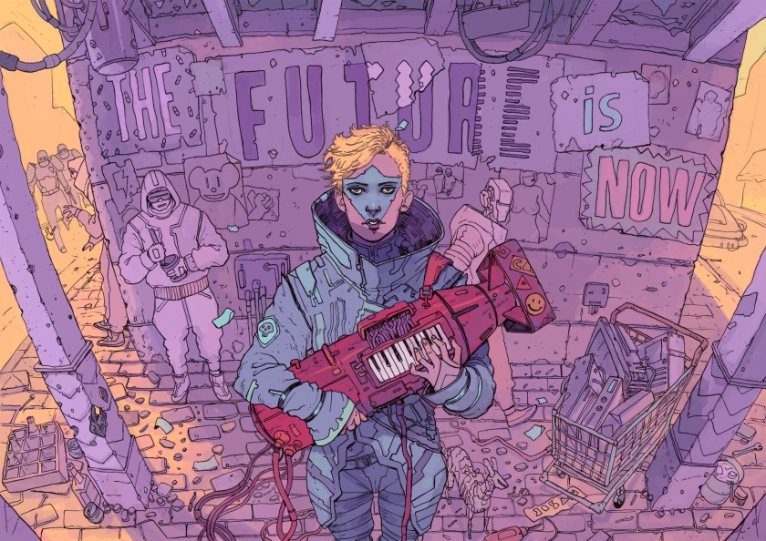
]
.footnote[(illustration : Moebius)]
---
## De quoi avez-vous besoin ?

* méthodologie projet archivage ?
* corpus théorique gestion des métadonnées ?
* contexte institutionnel et archivage électronique ?

---
## Corpus théorique

**Définitions**

> **Record management** : **organisation** des opérations permettant de **contrôler les processus** de production documentaire

> L’**archivage pérenne** des documents électroniques : **conservation** des documents et données et **des informations** qu’ils contiennent :
* Dans leur aspect physique comme dans leur aspect intellectuel
* Sur le très long terme
* De manière à ce qu’ils soient en permanence accessibles et compréhensibles

---

## Gestion des activités documentaires

La **norme ISO 30300** dite "gestion des documents d'activité" permet d'inclure les aspects essentiels à la mise en place d'une **stratégie de gestion de la production documentaire** en reprenant des concepts issus des normes de gestion de la qualité :
* l’efficacité de toutes les activités « métier » d’une organisation,
* la **responsabilisation** de tous les acteurs,
* la gestion des **risques**,
* la **continuité** des opérations.

---

## Un petit détour par la vision processus

> **processus** : ensemble ordonnées d'activités qui délivre un produit et/ou un service, à un "client" interne ou externe, lui apporte de la valeur, répond à ses besoins exprimés ou implicites et nécessite d'être maîtrisé/piloté

> **processus métier** : ensemble des activités qui s’enchaînent pour créer un produit ou un service à partir d’éléments de base. Un processus se décompose en sous-processus. (MAC, glossaire de l'archivage)

---
## Modèle de processus

|Durée/date | Acteur 1 | Acteur 2 | Documents |
|------|:--------------------:|:-----:|:----:|
|04/12/2017|Action 1 --->|Action 2|Version 0.1|
|04/12/2017|Action 3||version 0.2|
---
## Macro-processus de RM

.pull-left[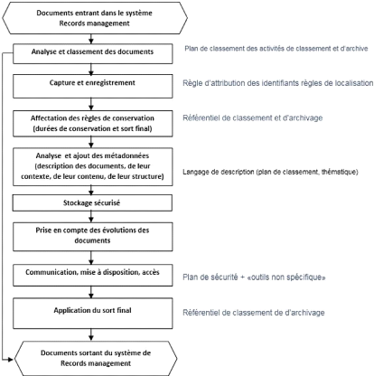]
.pull-right[.reduite[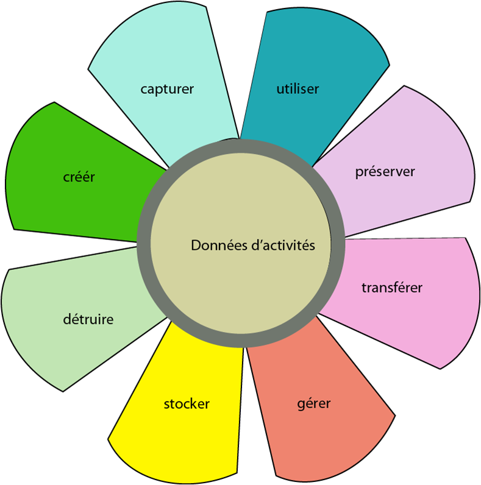]]

---
class: center, top
## Modélisation d'un processus
1. On commence par définir les diagrammes de cas d'utilisation (Use Case)

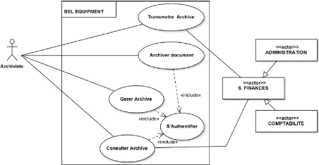

<!--
Qui permettent de donner une vue globale de l'application. Pas seulement pour un client non avisé qui aura l'idée de sa future application mais aussi le développeur s'en sert pour le développement des interfaces.

La représentation d'un cas d'utilisation met en jeu trois concepts : l'acteur, le cas d'utilisation et l'interaction entre l'acteur et le cas d'utilisation.

Cas d'utilisation : Un cas d'utilisation (use case) représente un ensemble de séquences d'actions qui sont réalisées par le système et qui produisent un résultat observable intéressant pour un acteur particulier

-->

---
class: center, top

## Modélisation d'un processus

2. Ensuite on va présenter la chronologie des opérations par les diagrammes de séquences.

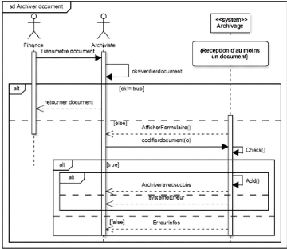
---
class: center, top
## Modélisation d'un processus

3. Et finir par les diagrammes statiques, qui sont celles de classe de conception, de classe participantes et le modèle physique.
]

.
---

## Organisation
.pull-left[
La dématérialisation produit ou renforce de nouveaux processus :
* Gestion des **droits** : la mise à jour de l'annuaire devient critique
* Gestion des **circuits** / processus dématérialisés
  * maintenance,
  * nouveaux processus,
  * adaptation vs réorganisation, ...
* Gestion des **référentiels** de métadonnées : outils et correspondants métiers sont essentiels

]
.pull-right[]

.footnote[Illustration: Edwin D. Babbitt’s The Principles of Light and Color (1878) — [Source](https://archive.org/details/gri_c00033125011227010).]
---

## Organisation
.pull-left[
* Gestion de l'enrichissement des documents grâce aux référentiels : comment les utilisateurs enrichissent leurs documents, à quelle dose, comment ?
* Gestion de la **contribution** des utilisateurs aux référentiels
* Gestion documentaire: les basiques du classement et des fonctionnalités associées.
* La **recherche** d'information :c'est un processus qui doit être clair pour les utilisateurs.
* Le travail **collaboratif** : méthodologie à mettre en place.
* **Architecture** de l'information : un nouveau métier, une fonction dédiée ?

]
.pull-right[]

.footnote[Illustration: NASA Ames Research Center (1970) — [Source](https://settlement.arc.nasa.gov/70sArt/art.html).]

---

## Collectivisation de la production
Proposer de passer d'une logique de gestion **individuelle inconsistante, éphémère et isolée** à une logique de gestion **collective organisée, contrôlée et partagée**

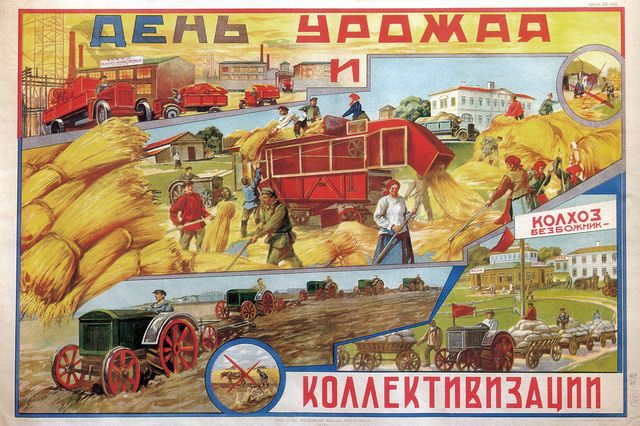
---

## Cycle de vie des documents engageants (records)
  * problématique de nommage
  * versionnage
  * copie
  * validation
  * validité

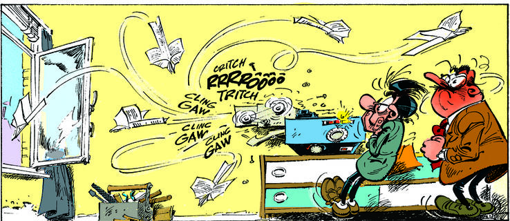

---

## Continuum information

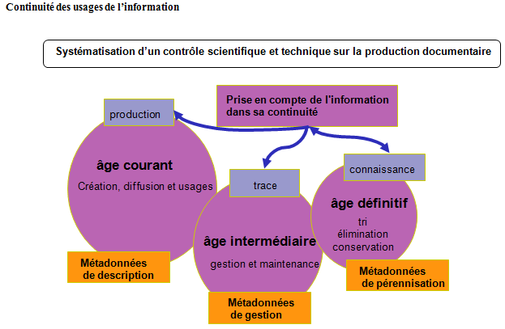

---

## La gestion de l'archivage
### production vs. conservation

---

## Parallélisme des âges
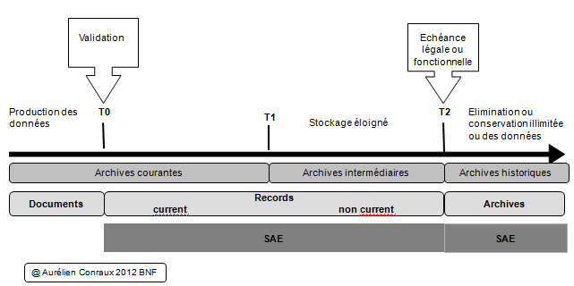
---
## Qualifier et classer l'information numérique : caractéristiques internes et externe
.pull-left[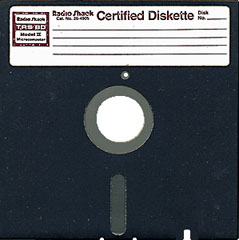]
.pull-right[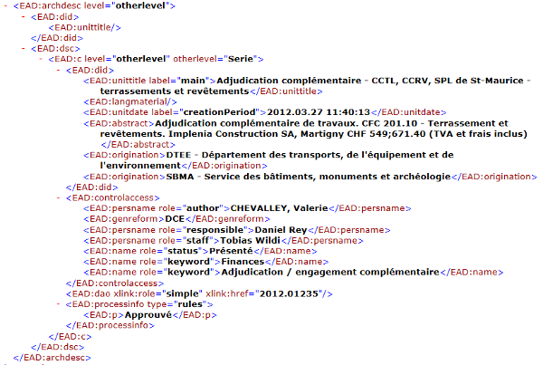]

---

### Caractéristiques internes
.pull-left[
* nom (identifiant)
* titre
* description
* date de création
* date de dernière modification
* auteur (contexte de production)
* format
* indexation
* somme de contrôle
]
.pull-right[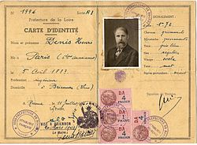]
---

### Caractéristiques externes
.pull-left[
* version
* classification de diffusion
* classification de publication
* sort final
* DUA
* signature
]
.pull-right[]

---

## Contraintes réglementaires et risques
### Archiver pour prouver et pour tracer

.pull-left[
* transfert de responsabilités
* stockage sécurisé
* gel de l'original
* journal des événements
]
.pull-right[]
---
## La gestion des risques

* éviter que des documents/données ne soient pas archivés
* éviter que des données/documents soient modifiés
* trouver facilement l'information
* éviter que des documents/données ne soient détruits trop tôt
* éviter que des documents/données soient conservés trop longtemps

.reduite[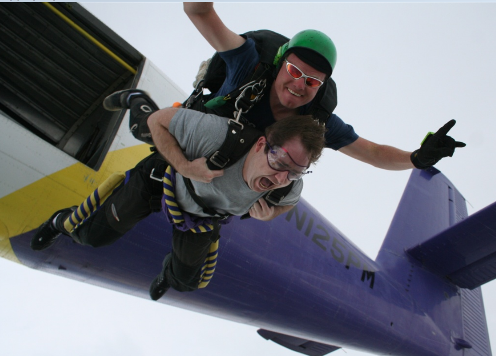]
---

## Gestion de la qualité
Le records management impose aux producteurs de documents de considérer le document, quel que soit son support, **dès sa création**, en fonction des **différentes valeurs** qu’il peut avoir et **des fonctions** qu’il remplit.

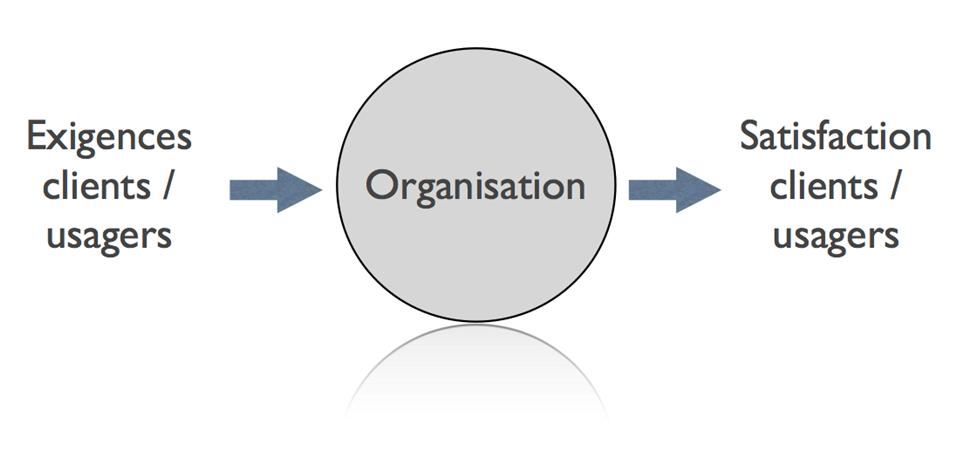

---

## Enjeux pour l'organisation

### Performance et connaissance

* Réduire les coûts : **conserver efficacement** les informations critiques  et y accéder rapidement
* Se conformer à la **règlementation**

--
* Le capital immatériel de la collectivité est un **levier majeur** de la chaîne de valeur
* Il répond à un besoin croissant de **collaboration et de communication**
* Il faut mettre en place les moyens pour **exploiter avec efficience** ces contenus

---
## Enjeux pour l'organisation

### Risques juridiques et financiers
.pull-left[
* Coût global de stockage qui s’élève
* Coûts passé à rechercher et à extraire les données
* Un éparpillement dans des outils différents
* Pas de « référentiels »
* Une gestion désordonnée entraîne des pertes de temps et d’informations
* Pas de capitalisation de la connaissance commune
* Perte d’identité et contentieux
]
.pull-right[
]
---

## Evaluation de la production
Le but du records management est de **lier un document à l'activité qui l'a produit et au contexte dans lequel il a été créé** avec des moyens suffisants pour qu'il puisse ultérieurement être **accepté comme authentique** et représentatif de l'information d'origine.

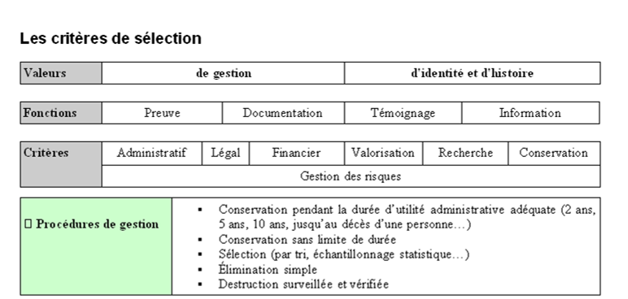

---

## Certification de la production
.pull-left[
Le mécanisme de signature doit permettre (selon art. 1316-1 du Code civil) :

* **d’identifier / authentifier** l’auteur d’un document (traçabilité)
* de **garantir** que l’auteur a bien émis ce document et pas un autre
(intégrité : le document n’a pas été altéré entre l‘émission et le moment où le lecteur le consulte)
]
.pull-right[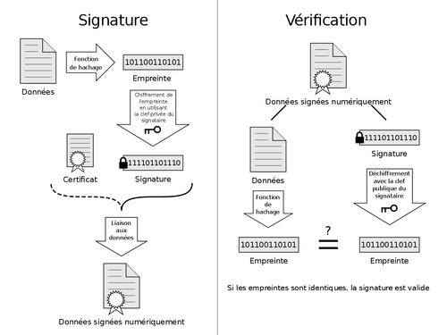]
---

## Gestion de la preuve
> Intégrité : le respect cumulé de trois critères
* la lisibilité du document
* la stabilité du contenu informationnel
* la traçabilité des opérations sur le document

Dans la mesure où devant le juge, se posent les questions de recevabilité et de force probante des documents électroniques archivés, les critères de l’intégrité doivent impérativement être édictés afin de permettre de définir les conditions dans lesquelles un document conservé pourra avoir valeur probante.

---

## Gouvernance documentaire
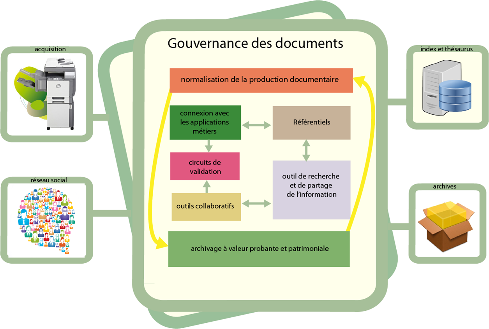

---

## Gestion transverse de l'information
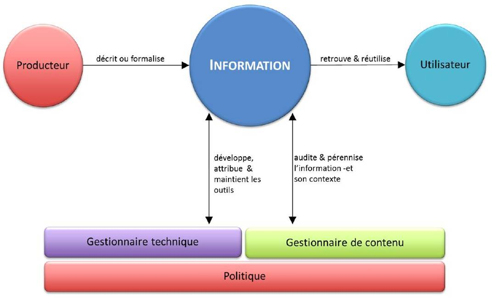

---

## Moyens transverses
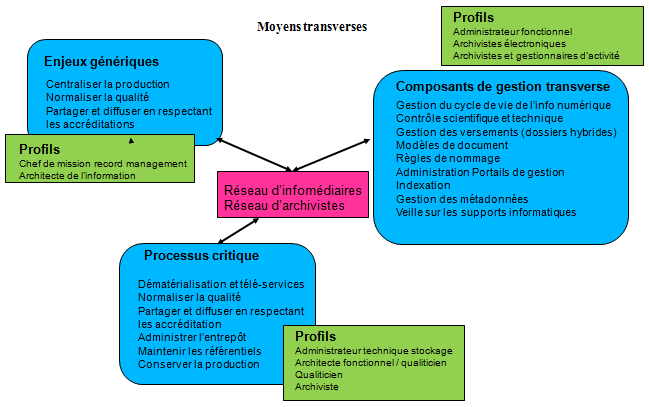

---

## Politique de gestion de l'information
>Définition du cycle de vie de l'information
-> une analyse des **processus** de travail  + **réglementation** + **besoins** de gestion

* **Identification** des documents liés à la continuité de l’activité
* Définition des **durées de conservation**
(combien de temps les documents seront-ils nécessaires) ? À partir de quel moment peut-on les détruire ?)
* Définition des règles de **communicabilité**
(quel est le délai pour rendre une information librement accessible à tous ?)

---

## Les 3 âges électroniques

---

## La politique d'archivage électronique
.reduite[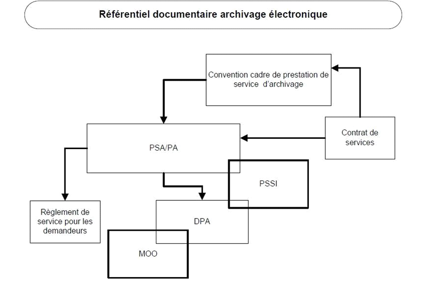]
---
## Référentiel documentaire PA

* **PSA/PA** : politique de service d'archivage / politique d'archivage
* **MOO** : mise en oeuvre opérationnelle
* **DPA** : déclaration des pratiques d'archivage (vise ensuite à définir comment l'AA s'organise pour répondre aux objectifs et engagements de la (des) PA ainsi qu'à identifier les procédures opérationnelles et les moyens mis en œuvre pour cela)
* **PSSI** : politique de sécurité des systèmes d'informations

[ressource complémentaire SSI](https://www.ssi.gouv.fr/archive/fr/confiance/documents/methodes/ArchivageSecurise-P2A-2006-07-24.pdf)

---

## Gestion
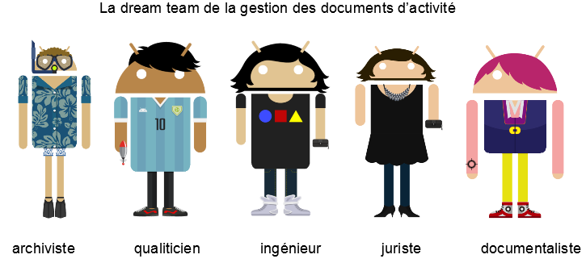
---

### Les métadonnées de pérennisation

---

#### Introduction sur les Métadonnées en général
**définition**
> Une métadonnée est une donnée servant à **définir ou décrire** une autre donnée. **Porteuse d'information** sur le **contexte**, le **sens** et la **finalité** de la ressource informationnelle portée par la **donnée brute**.

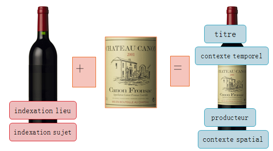

---

### Structuration de l'information
La structuration de l’information est la clé qui assure la versatilité des usages qui peuvent être capitalisés à partir d’un même processus de description

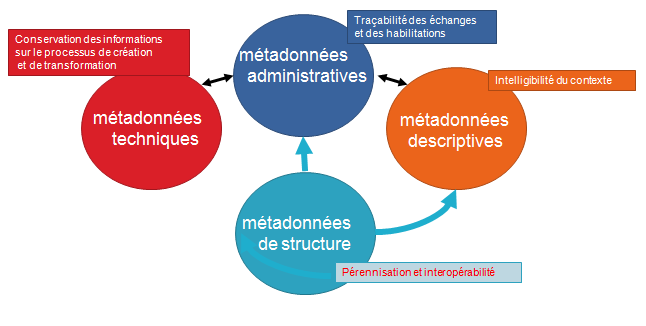

---

## Le modèle d’information de l’OAIS
### L'objet information

.pull-left[
l’Objet Information est composé d’un **objet données**
(physique ou numérique) et de l’information de représentation qui permettent d’interpréter les données sous la forme d’une **information compréhensible**.
]
--
.pull-right[.reduite[]
]
---

**l'information de représentation**

.pull-left[
Basée sur la récursivité, elle permet de représenter les différentes composantes de l'information

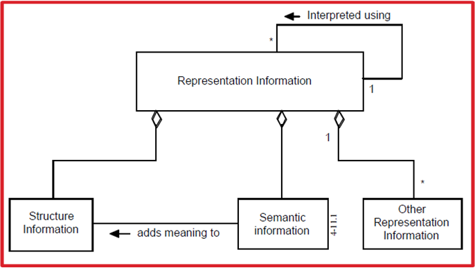
]
--
.pull-right[
**Composition**

Elle peut être composée des typologies suivantes :
* **Information de structure** :
types de données courants en informatique, comme des caractères, des nombres, des pixels, des tableaux

* **Information sémantique** :
informations complémentaires associées aux éléments de structure, telles que la langue dans laquelle l’objet est exprimé, les opérations réalisables sur chaque type de données et leurs relations, etc.

* **Autres**:
Identifiants d’autres standards comme la référence à la norme ASCII
]
---

**L'information de pérennisation**

.pull-left[
Elle doit permettre d'expliciter le contexte de production

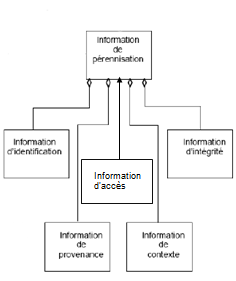
]
--
.pull-right[
Elle peut être composée des typologies suivantes :

* **Information de provenance** : décrit l’origine du contenu d’information, qui en a la charge, et quel est l’historique de ses modifications

* **Information de contexte** : décrit comment le contenu d’information s’articule avec d’autres informations à l’extérieur du paquet

* **Information d’identification** : fournit un ou plusieurs identifiants ou systèmes d’identification

* **Information de droits d’accès** (Access Rights Information) : information qui identifie les restrictions d’accès portant sur l’information de contenu

* **Information d’intégrité** : protège le contenu d’information contre les altérations non documentées
]

---
### Les métadonnées descriptives

.pull-left[**Décrire le contexte et les relations : le projet de norme Records in Context**

Intégration des standards de description ISAD(G), ISAAR(CPF), ISDF et ISDIAH
Les entités de ce modèle s’articulent autour de la notion de record
]
.pull-right[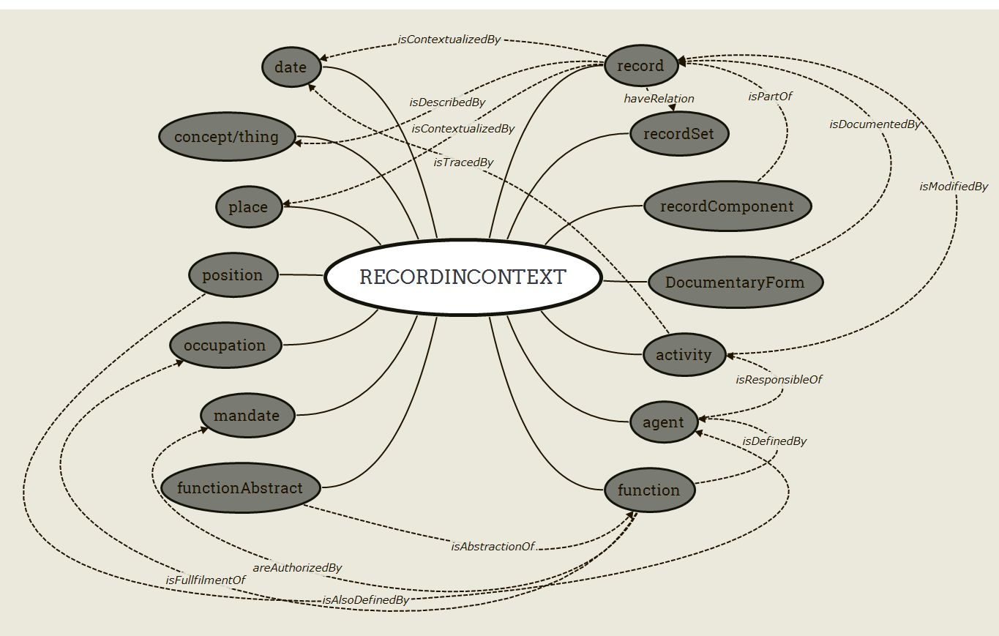]
---

## Mise en oeuvre
.reduite[]
---

## Mise en oeuvre opérationnelle
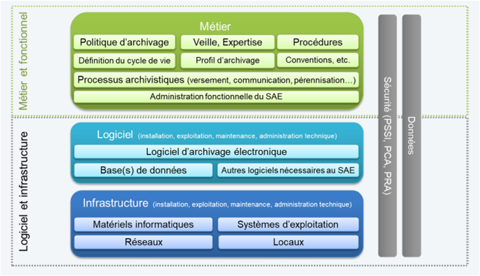
---
## La vision SAEM Girondin

---
## Mise en œuvre du projet et méthodogie
* 2010 : Initiative du Conseil général de la Gironde de rechercher des partenaires pour mettre en place une plateforme d’archivage électronique mutualisée.

* 2011 : Réunions avec les grosses collectivités aquitaines, puis rencontres bilatérales et lancement du projet piloté par le Conseil général.

**La première priorité** : définir le cadre du partenariat et les modalités d’achat commun de prestations. Pour chaque phase, rédaction d’une convention de partenariat comportant en annexe une convention de groupement de commande, votée par l’instance délibérante de chaque collectivité

---

## Découpage du projet en trois étapes
* phase 1 – Étude et prototypage à partir du socle Alfresco As@lae
* phase 2 – Développements complémentaires sur les briques du socles ou d’autres briques fonctionnelles, études complémentaires et rayonnement du projet
* phase 3 – Exploitation puis généralisation du système d’archivage électronique.

---
## Modalités de gouvernance
**Les partenaires** : le conseil régional d’Aquitaine (phase 1), le conseil départemental de la Gironde, Bordeaux métropole, la ville de Bordeaux

#### Organisation :
Pilotage assuré par le département

Instances :
* Comité projet (COPROJ) : un binôme chef de projet SI et chef de projet archives par collectivité
* Comité technique (COTECH) : COPROJ + directeurs SI et archives
* Comité de pilotage (COPIL) : COTECH + DGS
* Commission d’homologation (RGS) : RSSI + directeurs SI et archives
* Groupes de travail thématiques réunissant des experts en tant que de besoin

---
## Objectifs

* Mettre en place un partenariat exemplaire entre les membres fondateurs afin de mutualiser les expériences des partenaires et favoriser la montée en compétences de chacun,

* Optimiser et partager les coûts d’investissement des collectivités sur le prototypage d’un SAE,

* Construire ensemble une offre d’archivage électronique de confiance qui pourra être ouverte à d’autres utilisateurs autour des membres fondateurs.

---

## Orientations partagées

* Utiliser de solutions libres : Alfresco et As@lae pour le socle commun

* Réutiliser les développements réalisés par d’autres collectivités sur la 	plateforme cible

* Reverser les développements réalisés dans un espace accessible à tous

* Faire émerger un ensemble de bonnes pratiques basé sur le contexte 	normalisé (OAIS, SEDA, etc.)

* Permettre que le SAE puisse recevoir en grande variété d’archives

* Mettre en œuvre une gouvernance des risques conformément au RGS

---

## Financement
* partagé à part égale entre les partenaires
  * Phase 1 : 49 500 € TTC par collectivité
  * Phase 2 : 200 000 € TTC par collectivité

--
* deux subventions accordées par le SIAF dans le cadre des appels à projet AD-ESSOR
  * 2014 : 30 000 €
  * 2015 : 33 900 €
  * 2016 : 23 969 €
  * 2017 : 22 700 €

---
## Organisation
### Travail
* Moyens humains consacrés : 5 jours/semaine pour le pilote et 3 jours/semaine pour les partenaires
* COPROJ (2 demi journées par semaine)

### Outils mis en œuvre
* Espace collaboratif sur Alfresco pour le partage des documents et du planning
* Infrastructures techniques mises à disposition par le Département
* Espaces mis à disposition par les prestataires dans le cadre des marchés (cubicweb avec Logilab, Jira avec Atos)
* Pad prise de note partagé (framapad), dépôt de source et gestion de la documentation en ligne (framagit/readthedocs)

---
## La méthode Agile pour le développement

.pull-left[Ateliers fonctionnels (brainstorming et séances de post-it) : partage et ajustement réguliers de la vision « produit »]
.pull-right[

]

---
## Les user stories

.pull-left[Rédactions en commun de users stories (US) : « en tant que (rôle).. je veux (fonctionnalité métier)… afin de (objectif)… » + critères d’acceptation pour tests]
.pull-right[]

---
## Le backlog
.pull-left[

* Alimentation du backlog (https://extranet.logilab.fr/project/SAEM-Ref)
* Déclinaison par le prestataire en tâches de développement et estimation de la charge
* Définition de sprints : développements sur 3-4 semaines, recettes, poursuite
]
.pull-right[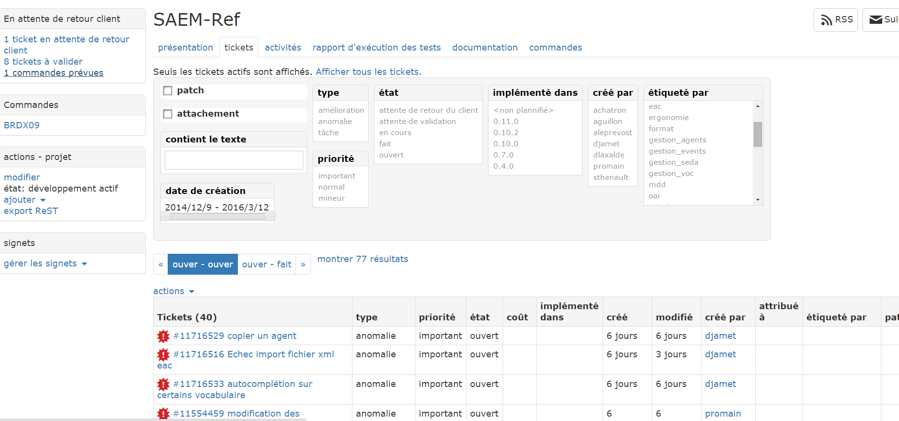]

---
## Réalisation et bilan phase 1
* Phase 1 : prototype et études
  * Flux d’archivage délibérations (documents et vidéos)
  * marchés publics
* Modélisation des processus métiers archives
* Développement d’un module Alfresco open source
* Développement de web services avec as@lae
* Ecriture d’une politique de service d’archivage
* Réalisation d’une analyse RGS Ebios
* Rédaction d’un cahier de spécifications détaillées
* Réalisation d’une matrice fonctionnelle

--

* Développement des compétences internes
* Réflexion sur les modalités juridiques de mutualisation
---
## Réalisation et bilan phase 1
* Coûts :
  * 50k€ par partenaire soit 200k€
  * 145 j de développement
  * 65 j d’études
  * 3j/sem pendant 1 an

--
* Audit de conformité :
  * 40% des exigences couvertes
---
## Bilan de la phase 2 : focus sur réalisation d’une matrice fonctionnelle  
* Objectifs de la matrice fonctionnelle :
  * Obtenir une vision complète de tous les besoins à couvrir dans un SAE digne de confiance
  * Estimer le travail restant à réaliser
  * Evaluer les charges et les budgets nécessaires
* Contenu de la matrice fonctionnelle :
  * 608 fonctionnalités issues des :
    * users stories
    * exigences SIAF, OAIS, NF 42-013
* spécifications fonctionnelles (études complémentaires)
	 * Réparties entre les 9 briques de la vision modulaire
	 * Classées par niveau de priorité
	 * (bloquant / critique / important / mineur / trivial)
	 * Evaluées par niveau de complexité (simple / moyen / complexe) et coûts induits
---
## Phase 2 : développements
* conception d’une ontologie SAEM
* conception et réalisation d’un outil de gestion des référentiels de données pour l’archivage (vocabulaires, acteurs, profils)
* développements de connecteurs entre les modules (OAI-PMH)
* poursuite des développement du module Alfresco et des web services as@lae
* rédaction d’une convention d’exploitation (phase 3)
---

## Phase 2 : bilan
* Coûts :
  * 200k€ par partenaire soit 600k€
  * 245 j de développement
  * 3j/sem pendant 3 ans

--
* Audit de conformité :
  * 80% des exigences couvertes  

--
* Préparation de la phase 3 :
  * développement de connecteurs applicatifs pour le flux PES V2
  * développement d’une interface avec Arkhéia (en cours)  
---

### Par où commencer ?

|étape | solutions applicatives          | solutions humaines | documentation |
|------|:--------------------:|:-----:|:----:|
|première étape|stockage organisé et documenté|gestion de la conservation|politique d'archivage|
|cible intermédiaire|Données de référence / SAE|gestion des référentiels / gestion de la conservation|guide bonnes pratiques / politique d'archivage|
|cible RM|Ged|gestion de la production courant / identification des records|guide de nommage / indexation|
|cible SAE|Référentiel / GED / SAE|gestion des référentiels / record manager / gestion de la conservation|politique de gestion des données / politique d'archivage / Politique de gestion du SI|

---

### Le lean canvas pour itérer sur la vision
1. Identifier les parties prenantes (éventuellement les premiers utilisateurs de la solution mise en place)
2. Identifier leurs problèmes (et les solutions (de contournement) qu’ils utilisent)
3. Identifier les solutions disponibles
4. Identifier les critères d’évaluation de la valeur apportée par la solution envisagée
5. Identifier les critères de légitimité du(des) porteur de projets
6. Identifier les canaux de communication mobilisables pour faire parler de son projet
7. Identifier le concept à haute valeur ajoutée et la proposition de valeur associée au projet
8. Identifier les coûts
9. Identifier les revenus ou les gains

---

### Choix du scenarii en fonction :

* des ressources humaines nécessaires,
* des moyens techniques à mobiliser,
* des moyens financiers à prévoir,
* de la volonté stratégique,
* la maturité vis-à-vis du numérique et des archives.

 et pour les acteurs publics de **l’environnement institutionnel et du contexte territorial**

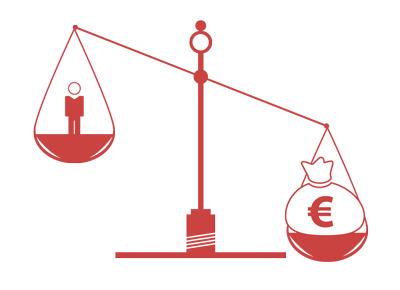
---
class:center,top
### Cas de figure : commune
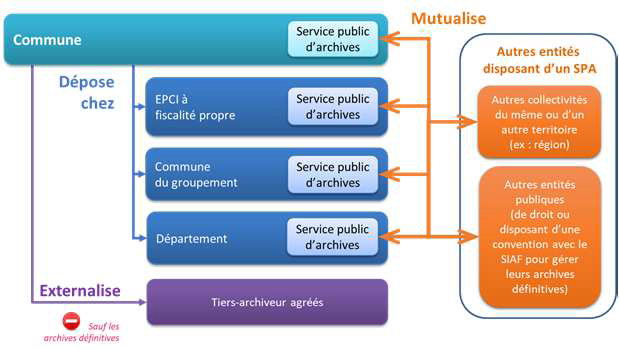

---
class:center,top
### Cas de figure : EPCI
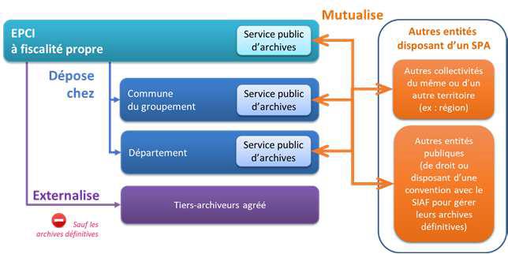

---
class:center,top
### Cas de figure : EPL
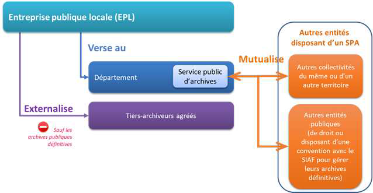
---
class: center,top
### Votre projet : version classique

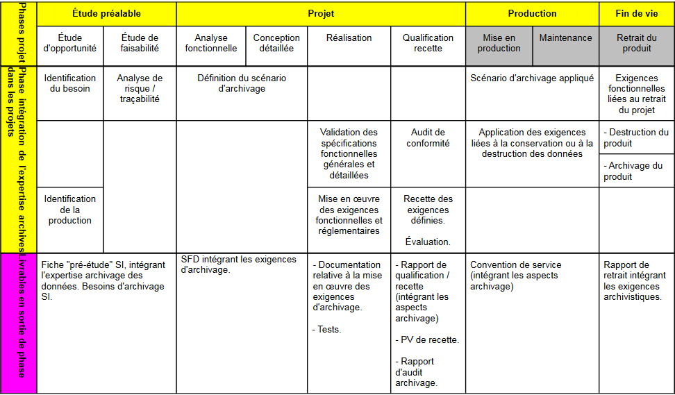
---
class: center, top
### MVP
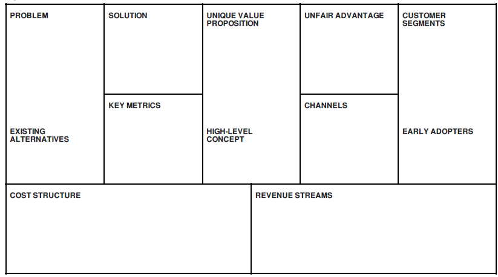

<!--
* « Logiciel fonctionnel plutôt que documentation complète » : il est vital que l'application fonctionne. Le reste, et notamment la documentation technique, est secondaire, même si une documentation succincte et précise est utile comme moyen de communication.

* « Collaboration avec le client plutôt que la négociation du contrat » : le client doit être impliqué dans le développement. On ne peut se contenter de négocier un contrat au début du projet, puis de négliger les demandes du client.

* « Réagir au changement plutôt que suivre un plan » : la planification initiale et la structure du logiciel doivent être flexibles afin de permettre l'évolution de la demande du client tout au long du projet.

-->
---
### exercice
1. Remplir le canvas pour mettre en place votre première itération

2. [correction](corrigeExercice.md)
4. [correction sae](corrigeExercice.md)
---
### Rétrospective
2. Les points satisfaisants
3. les points à améliorer

A votre disposition pour en parler :
* par mail : p.romain@gironde.fr
* sur twitter : @keronos

Pour en savoir plus sur le projet SAEM :
[le blog du SAEM](http://saem.e-bordeaux.org/blog)

**Merci pour votre attention !**
